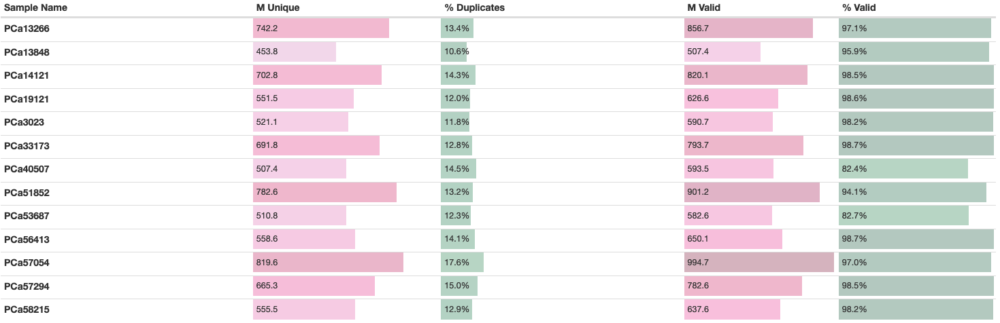
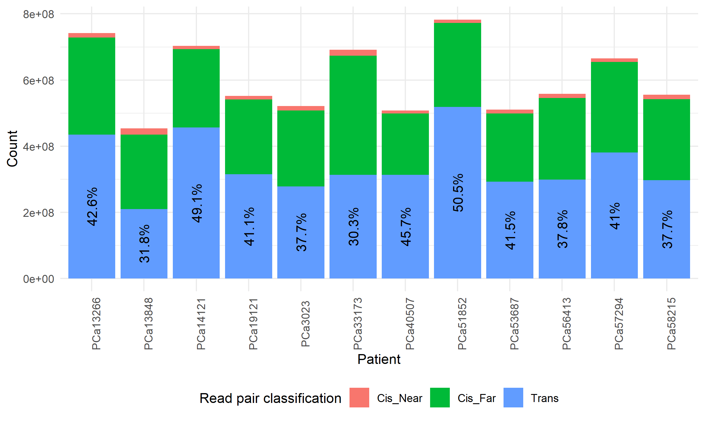

# Summary

This folder contains the aggregated data from both sequencing batches on the 12 CPC-GENE prostate cancer samples.
The preprocessing steps for this raw data can be found in `../../Raw/190509_A00827_0007_AHKYH3DSXX/` and `../../Raw/190605_A00827_0009_BHLGJ3DSXX/`.

This folder aggregates the BAMs, then uses `pairtools` and `cooler` to create multi-resolution cooler files for future analysis.

## Results

After using the HiCUP pipeline \Cref{Wingett2015} to pre-process each sample and merge data from multiple sequencing batches, we produced a set of 13 Hi-C samples, each with > 450M filtered, unique read pairs.

The sequencing depth is important since various publications have shown that there is difficulty in calling loops, TADs, and other genomic features from Hi-C data with fewer than 300M filtered read pairs.
Rao _et al._ \Cref{Rao2014} define "map resolution" to be smallest bin size such that 80% of loci have >= 1000 contacts.
Not accounting for mappability in different regions of the genome, fewer than 300M read pairs means 1000 reads per 10 kbp bin on average, yielding a map resolution near 10 kbp.

With >= 450M read pairs per sample, this equates to a map resolution near 6.7 kbp.
With >= 750M read pairs per sample, this equates to a map resolution near 4 kbp.

### These data have low duplication rates despite small input cell numbers

An issue with low-input sequencing methods is the high duplication rates often observed, due to the small amount of input DNA \Cref{Belaghzal2017, Diaz2018}.
Despite using tissue slides, which have approximately 2000 - 10 000 cells each, we observe duplication rates < 18% across all samples.
This was due to optimizing the library adapter kit, and shows the complexity of each sample.

### These data have high percentages of valid read pairs

High quality Hi-C libraries have most of their read pairs classified as `Valid` by HiCUP.
Across all 12 samples, the smallest `% Valid` value is 8.24% (in `PCa40507`), with 11/12 above 94% valid.

### These data have _cis_/_trans_ percentages comparable to other Low-C libraries

In the original method for the Low-C protocol \Cref{Diaz2018}, Supplementary Table 3 shows the following:

| Sample | Restriction Enzyme | Fraction _cis_ | Fraction _trans_ |
| ------ | ------------------ | -------------- | ---------------- |
| DLBCL  | MboI               | 0.615          | 0.385            |
| B-cell | MboI               | 0.624          | 0.376            |

For our samples, the percent of _trans_ reads is labelled below.

Thus, the fraction of _trans_ read pairs in our Hi-C data in primary prostate tumours is comparable to that in B-cells from previous literature \Cref{Diaz2018}.

## Conclusions

The Hi-C data generated from primary prostate tumour sections using our optimization of the Low-C protocol is a high-quality Hi-C dataset.
