# Summary

This folder contains sequencing data for LNCaP samples, using the Low-C protocol on 50K LNCaP cells, using two different library prep kits: Thruplex, and NEB.

## Motivation

We had used NEB for the previous shallow sequencing runs, but other than the 4 samples sequenced in `../190301_M04827_0182_000000000-C7LD7`, the remaining samples failed.
One of the issues was low yield of DNA, and after discussing with Jesse Dixon, Stanley tested out a few library kits.
The Thruplex on showed the best yield, so to confirm that we should switch to this kit, we ran a shallow sequencing run (1M reads total on a low output MiSeq) to see the quality of raw sequencing output we get.

## Results

### Thruplex shows better base call quality across the entire read, compared to NEB

Here are the base call quality scores, for each FASTQ:

NEB R1

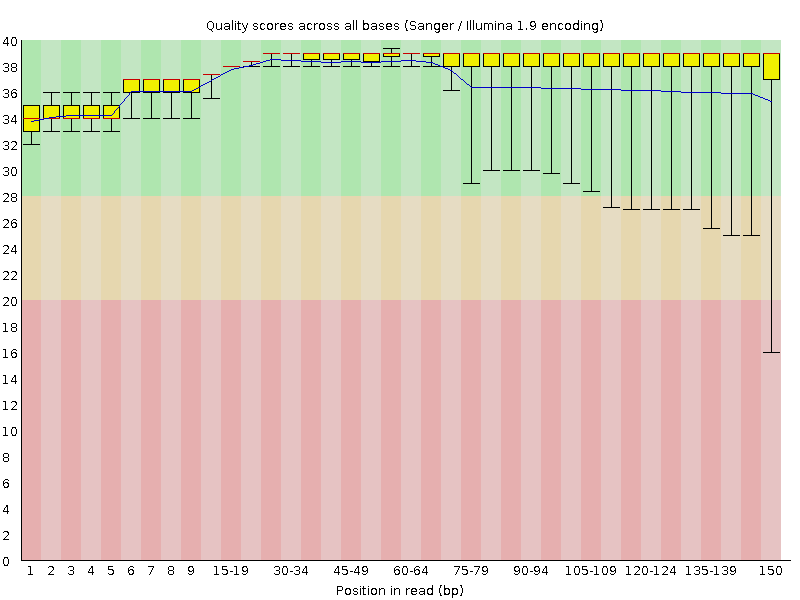

NEB R2

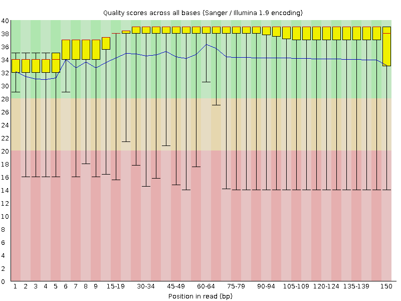

Thruplex R1

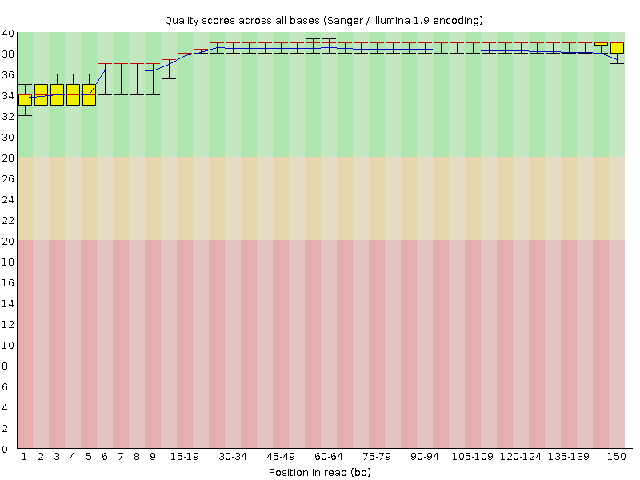

Thruplex R2

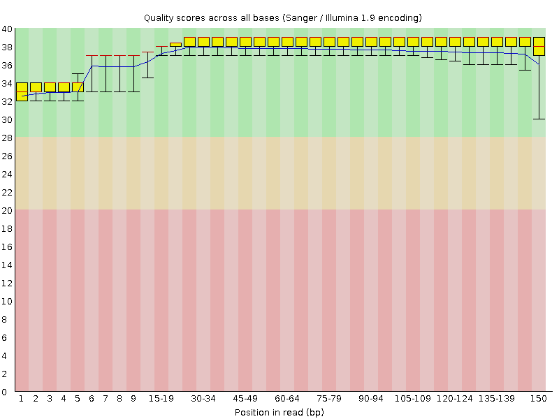

### Thruplex shows better base sequence content at the 3' end of each read than NEB, and shorter variation at the 5' end

NEB R1

NEB R2

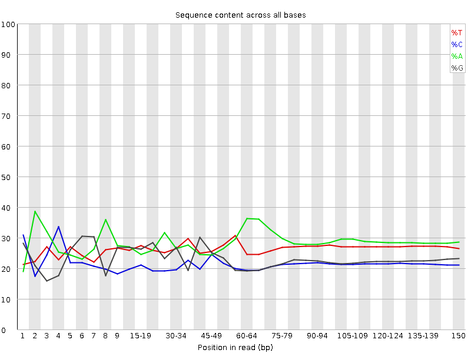

Thruplex R1

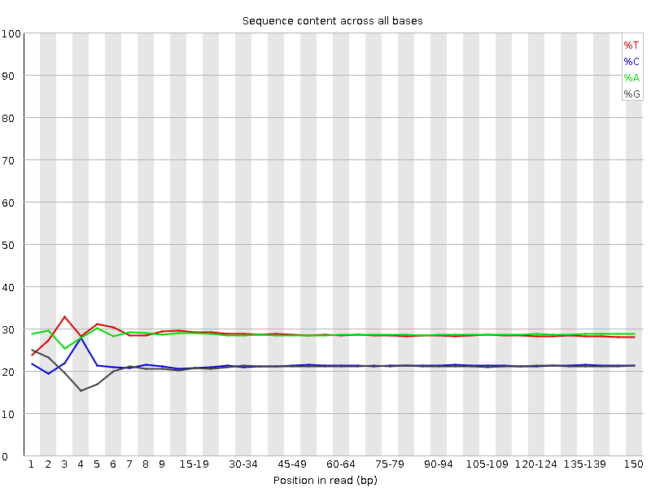

Thruplex R2

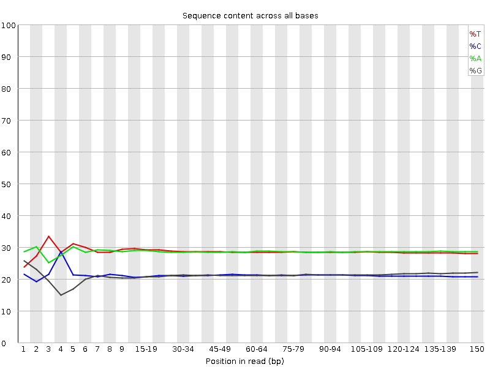

### Thruplex shows better duplication rates than NEB

NEB R1

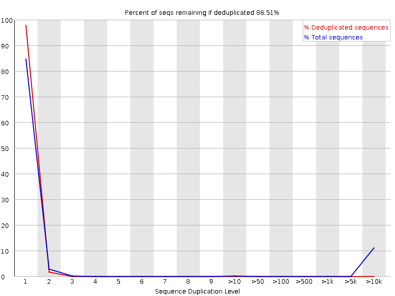

NEB R2

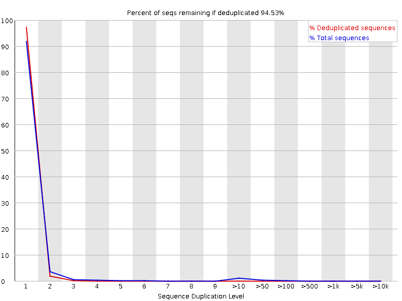

Thruplex R1

Thruplex R2

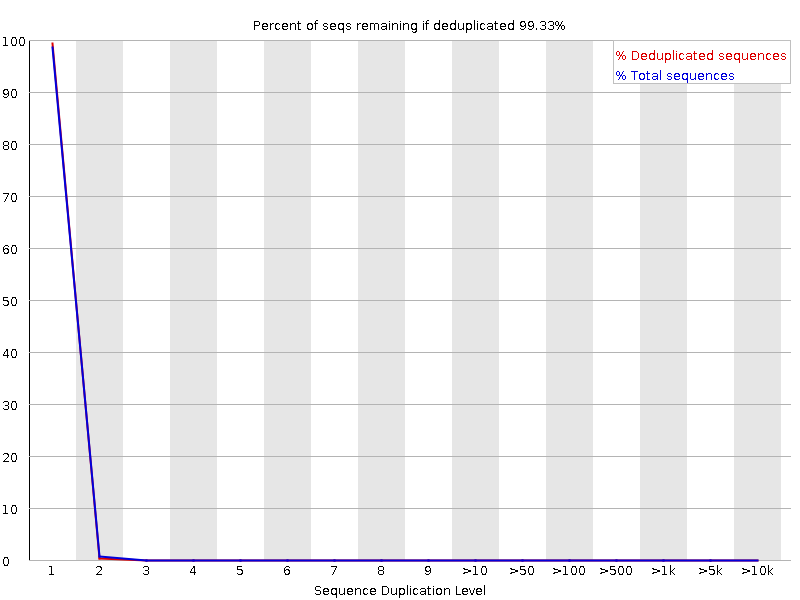

### NEB has less adapter contamination than Thruplex, but both are at acceptable levels

NEB R1

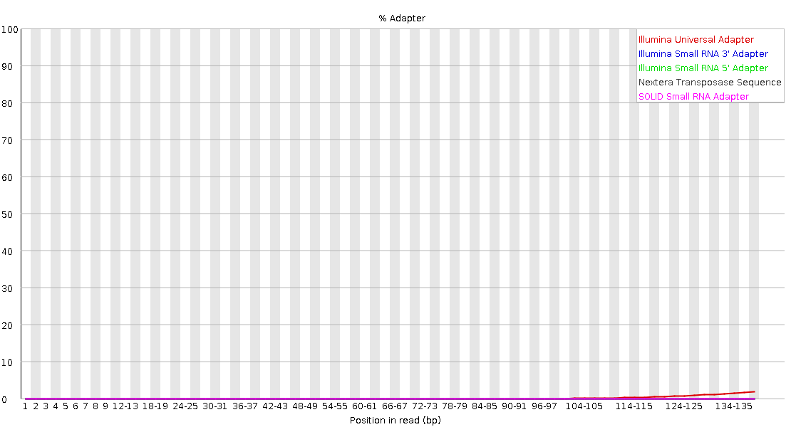

NEB R2

Thruplex R1

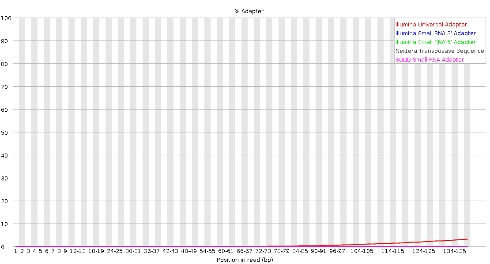

Thruplex R2

### Thruplex shows better overall mapping than NEB with a higher percentage of valid read pairs

NEB

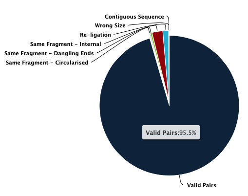

Thruplex

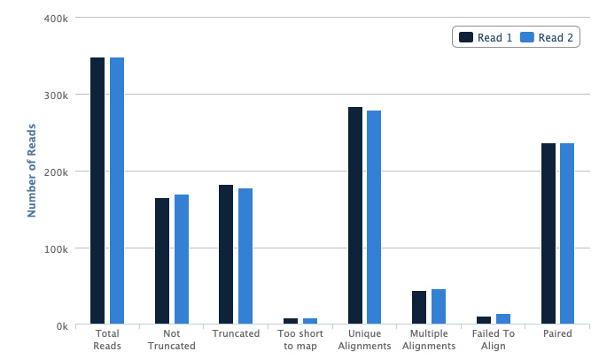
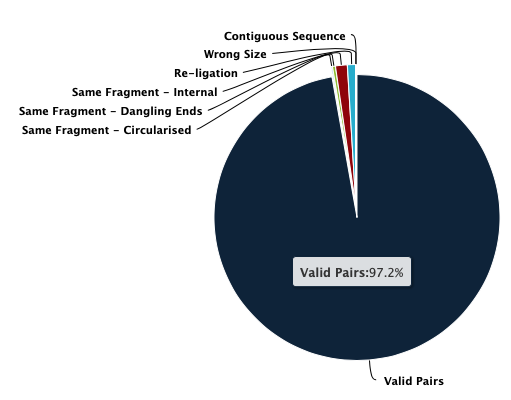

The Thruplex kit has a higher percentage unique alignments and paired reads than NEB, as well as a smaller percentage of reads that failed to align, or were removed due to Hi-C technical artefacts.

## Conclusions

The NEB kit, even at very shallow sequencing, shows artefacts that will be concerning at high sequencing depth, whereas the Thruplex kit does not show any of these artefacts.
Base call quality, sequence content, and duplication rates are all better in with the Thruplex kit than the NEB kit, and are reflected in the mapping quality scores.

We should move forward with the Thruplex kit for future experiments.
