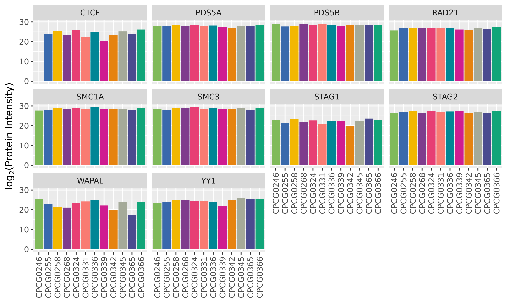

# Summary

This folder contains data showing the protein expression levels of various proteins relating to the cohesin complex, to see if there are patient-specific differences in the formation of this complex.

According to [Peter _et al._, Genes & Dev, 2008](http://genesdev.cshlp.org/content/22/22/3089.full), the following are cohesin complex subunits:

* SMC1A
* SMC1B
* SMC3
* RAD21
* REC8
* STAG1
* STAG2
* STAG3
* PDS5A
* PDS5B
* WAPAL
* CDCA5

Additionally, we are aware of the following factors involved in chromatin loop formation:

* ZNF143
* CTCF
* YY1

We look to these to see how prevalent their expression is the set of patient samples.

## Results

The above plot shows protein expression level for each protein of interest.
Proteins mentioned above and not shown here were not measured in the mass spec experiment.
Black line is median expression for that protein, and the grey shaded region is the 95th quantile of absolute median deviation of all proteins across the 13 samples.

All samples lie within this shaded region except for:

* CTCF in CPCG0246 (could not be measured, was `NA` in data)
* CTCF in CPCG0339
* STAG1 in CPCG0346
* WAPAL in CPCG0342 and CPCG0365

## Conclusions

Cohesin complex subunits and other chromatin loop associated factors are almost always equally expressed in the 13 patients in this study, with minor exceptions.
