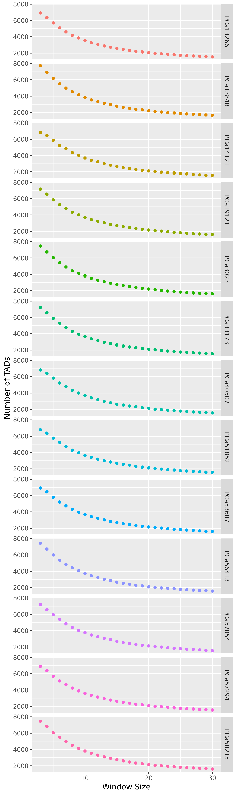
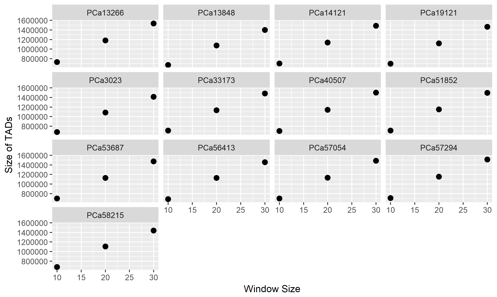
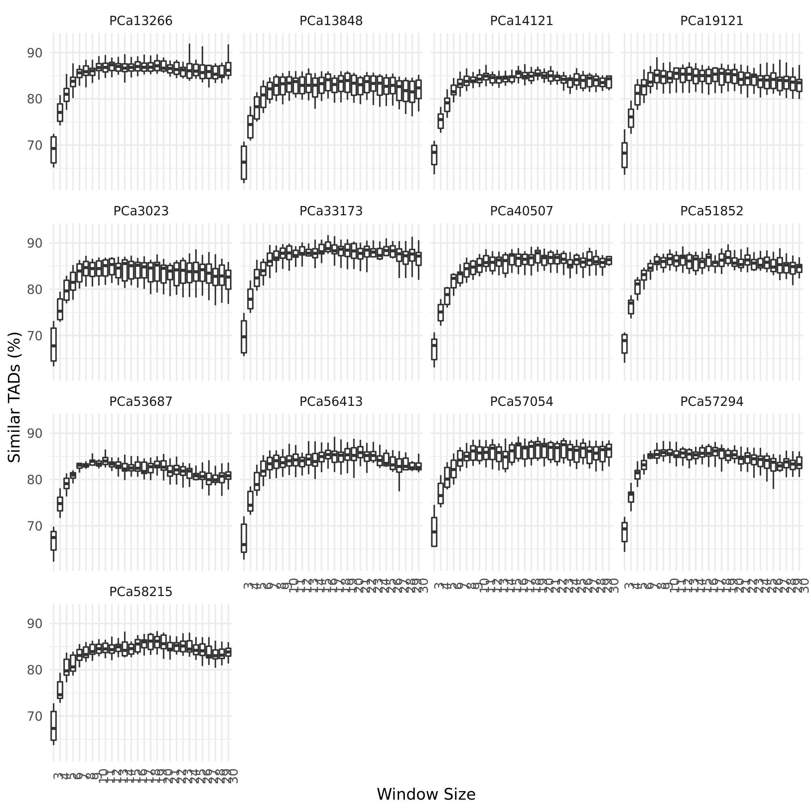

# Summary

This folder contains the hierarchical domains called by TopDom for all 13 prostate samples.
We us TopDom [1] (in `topdom.R`) to call topologically associated domains (TADs) using a set of window size parameters to give a hierarchical view of domain organization.

## Results

Using a contact matrix at a resolution of 40 kbp, we use a set of values for the window parameter ($w \in [3, 30]$) to detect TADs across a variety of length scales.

### TAD Statistics

We find, similarly to results from other groups, that the number of TADs increases for smaller $w$, and the number increases.

There are 7000-8000 TADs of 400 kbp on average ($w = 3$) and ~ 1700 TADs of 1.5 Mbp on average across all samples.

### TAD similarity

To see whether TADs are called similarly in different samples, we calculate which TADs are consistent in pairwise comparisons.
We do this by counting TADs called in separate samples with at least 60% bi-directional overlap (i.e. ${(a, b) : a,b \in A \cap B, \frac{|a \cap b|}{|b|} \ge 0.6, \frac{|a \cap b|}{|a|} \ge 0.6}$, where $A$ and $B$ are the regions in both samples).

We find that on average, ~68% of TADs are consistently called in other samples for small TADs ($w = 3$), whereas ~ 86% of TADs are consistently called for larger TADs (> 500 kbp, $w \ge 10$).

## References

[1]: Shin, H. et al. TopDom: an efficient and deterministic method for identifying topological domains in genomes. Nucleic Acids Res 44, e70–e70 (2016). doi: [10.1093/nar/gkv1505](https://doi.org/10.1093/nar/gkv1505)
