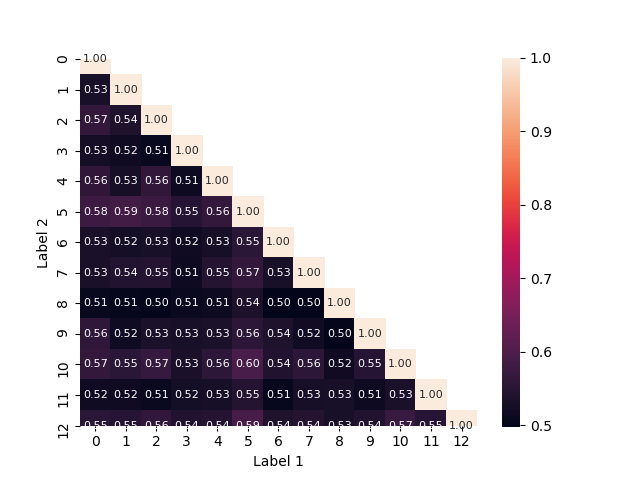
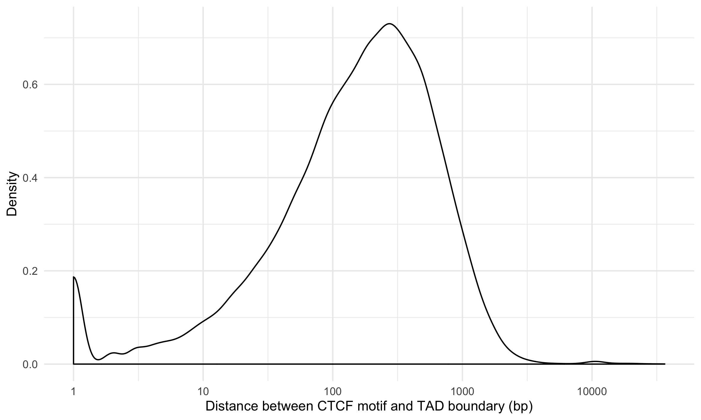
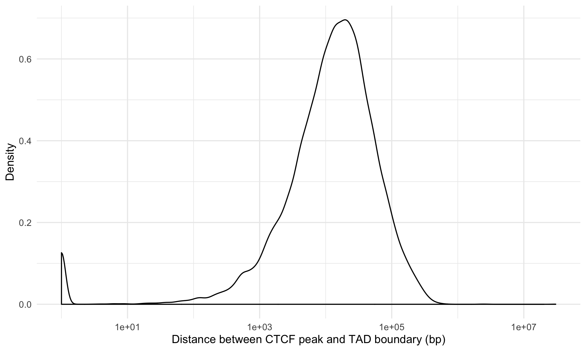
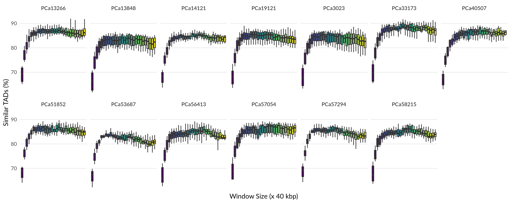

# Summary

This folder contains the analyses and interpretation of the TAD calls on all 13 prostate cancer samples done in [`../2020-01-15_TAD-aggregation/`](../2020-01-15_TAD-aggregation/).

## Results

### Boundary similarity

Due to the hierarchical nature of TADs, we compare the boundaries between patients to assess their similarity.
50-60% of boundaries overlap exactly between any pair of samples, leading to a set of 4998 boundaries universally shared across all prostate tumours and a consensus set of 31 465 boundaries in total.
A heatmap showing the Jaccard index between all pairs of samples is below, where each boundary is a single base pair.



```shell
> snakemake -p TAD-comparisons/intersection.bedGraph
> awk '{if ($4 == 13) print}' TAD-comparisons/intersection.bedGraph | wc -l
    4998
```

To account for minor differences in distance, we find that extending each boundary by +/- 20 kbp leads to 5863 universally-shared boundaries.

### Boundary proximity to CTCF binding sites

We hypothesize that these boundaries are biologically meaningful boundaries, and, as TADs are hypothesized to form via loop extrusion \Cref{Belghan2020}, will be located proximal to CTCF binding sites.
The majority of TAD boundaries are within a few hundred bp of CTCF motifs.



This appears to be independent of whether the boundary is shared across patients or not.


We can further support this by considering the distance to CTCF binding site peaks from ChIP-seq data in prostate cancer cell lines from ENCODE (see [`../../Data/External/ENCODE_ChIP/`](../../Data/External/ENCODE_ChIP/)).



The mode of peaks being within 10 kbp of TAD boundaries fits with observations of increased CTCF binding sites near boundaries (see \Cref{Dixon2012} Fig. 2b).
Thus, we observe TAD boundaries in close proximity to CTCF binding site peaks, as expected.

### TAD similarity

To see whether TADs are called similarly in different samples, we calculate which TADs are consistent in pairwise comparisons.
We do this by considering TADs called in a given sample and counting whether that region is called as a TAD in at least one other sample with at least 60% bi-directional overlap (i.e. ${(a, b) : a,b \in A \cap B, \frac{|a \cap b|}{|b|} \ge 0.6, \frac{|a \cap b|}{|a|} \ge 0.6}$, where $A$ and $B$ are the regions in both samples).

We find that on average, ~68% of TADs are consistently called in other samples for small TADs ($w = 3$), whereas ~ 77% of TADs are consistently called for larger TADs ($w = 30$), with a maximal consistency of 80.66% for $w = 9$.
The general trend can be seen below.



We see that for $w \ge 9$, the percentage of TADs in a given sample that are called similarly in another sample tends to drop slightly, but still remains greater than the consistency of TADs called with $w < 9$.
There is a monotonic reduction in mean similar TAD percentage for $w < 9$ for all samples.

These results suggest that large scale organization (on lengths scales of 400 kbp or larger) are largely similar across all samples, whereas small scale organization (< 400 kbp) differentiates samples, and may be where individual differences in etiology occur.

### Finding patient subsets with differential TADs

## Conclusions

## References

\Cref{Dixon2012}: J. R. Dixon et al., “Topological domains in mammalian genomes identified by analysis of chromatin interactions,” Nature, vol. 485, no. 7398, pp. 376–380, May 2012, doi: [10.1038/nature11082](https://doi.org/10.1038/nature11082).
