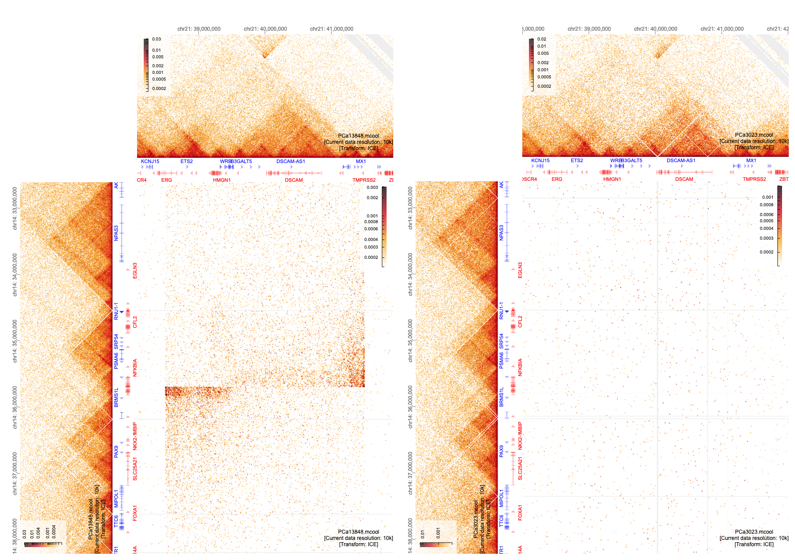
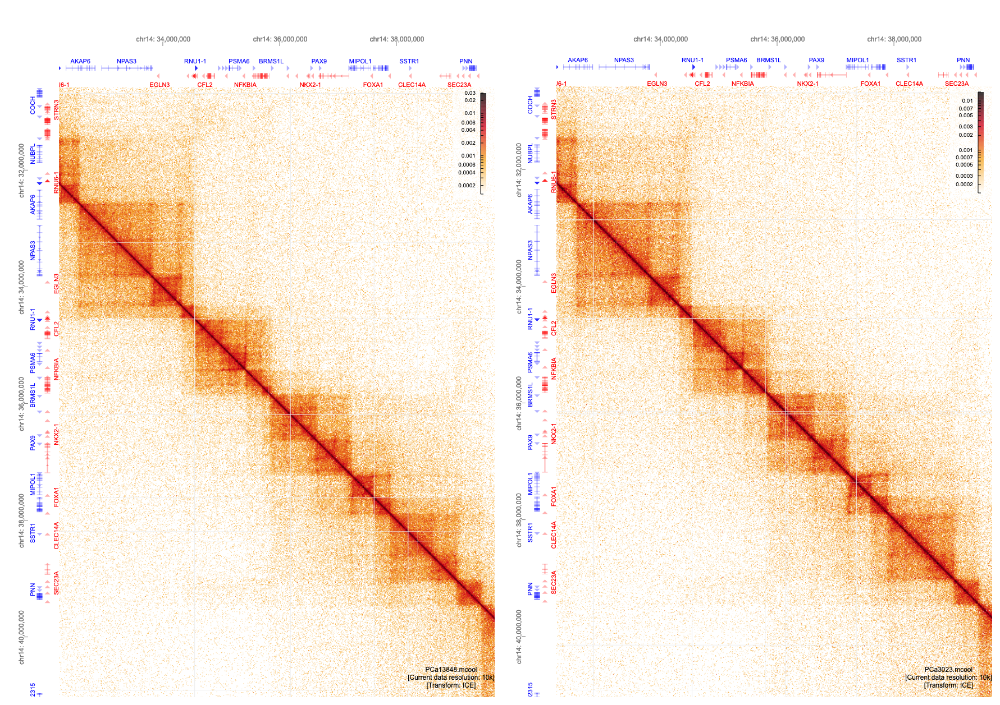
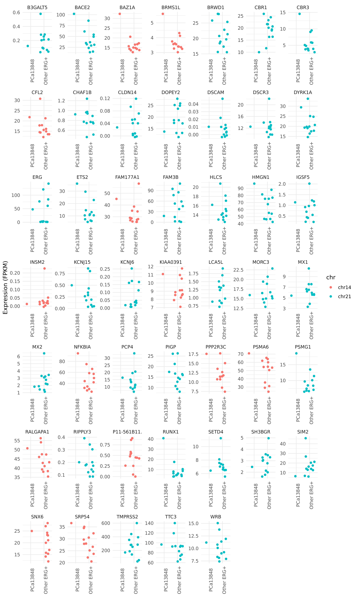

# Summary

This folder contains the breakpoints for structural variants (SVs) called by `hic_breakfinder`.
`inter_expect_1Mb.hg38.txt` and `intra_expect_100kb.hg38.txt` were downloaded from the [Dixon Lab's Box archive](https://salkinstitute.app.box.com/s/m8oyv2ypf8o3kcdsybzcmrpg032xnrgx) on 2019-07-24 (at the time of writing, these files were last updated on 2018-05-22).

## Results

### Structural variants can be detected with `hic_breakfinder`

`hic_breakfinder` identified between 6 and 78 SVs across all 13 samples, using default parameters.
The breakpoint calls can be found in `Breakpoints/Default/`.

Notably, the number of SVs correspond to ERG over-expression.
The 7 ERG over-expressing samples are listed within the top 8 positions ($\mathbb{P}[\text{ERG+ in top 8}] = \frac{\binom{6}{1}}{\binom{13}{6}} = 0.0035$).[^1]

It is also notable that in only 1 sample (`PCa51852`) was the T2E fusion detected, despite the fusion being visible in the contact matrices of all 6 samples with that fusion.

### Differences in structural variant detection is not due to differences in sequencing depth

We hypothesized that the T2E fusion was not being detected in the remaining 5 samples due to differences in read depths, given that `PCa51852` happens to be the sample with the T2E fusion with the most filtered read pairs.

After downsampling `PCa51852` and re-running `hic_breakfinder` with default parameters, the T2E fusion was still detected, suggesting this was not an issue of sequencing depth.
For details, see [`../2019-08-29_breakfinder-subsample/`](../2019-08-29_breakfinder-subsample/).

### Differences in structural variant detection likely stems from detection thresholds

Our next hypothesis for why the T2E fusion was not detected in all 6 samples where it is known to exist was due to the detection threshold implicit in `hic_breakfinder`.
The closeness of the deletion to the diagonal of the matrix may not contrast enough with the local background in the first stage of submatrix finding, leading to it not being detected at the 100 kbp resolution.
Jesse Dixon created a branch of `hic_breakfinder` that allows a pre-set log-odds ratio threshold to be set with the `--thresh` option.
`Breakpoints/Low_Thresh_*/` contains breakpoints found by running `hic_breakfinder` with the `--thresh` option, to increase the sensitivity to breakpoint calls.

Fixing the threshold at 30, `PCa51852` is still the only sample where the T2E fusion is detected.
Fixing the threshold at 20, `PCa56413` has the T2E fusion detected.
Due to the size of the deleted region leading to the fusion, and the increased detection at a lower log-odds threshold, this suggests that the threshold for reasonably small SVs close to the diagonal is the limiting factor for detecting this SV.

### Refined structural variant calls do not identify new variants

To refine the detected SVs for accurate location, we re-ran `hic_breakfinder` with the `--min-1kb` option.
Breakpoints can be found in [`Breakpoints/Min_1kbp/`](Breakpoints/Min_1kbp/).

These detected breakpoints are all the same as the default parameters, with some of the SVs having their resolution reduced from 10 kbp to 1 kbp, except in 1 case in `PCa56413` where two SVs on chr14 were combined into a single event at 1 kbp resolution.

Overall, this refinement of SVs may provide a more accurate location for each detection, but does not identify new variants.

### Detected structural variants still need to be manually annotated

`hic_breakfinder` \Cref{Dixon2018} finds a submatrix that has a local maximum in signal, and returns the row and column coordinates for this submatrix.
It does not indicate what type of structural variant it has detected, however.
While \Cref{Dix2018} provide heuristics for determining what a given SV will appear like in the contact matrix (see Supplementary Figure X), this is not incorporated into their statistical model.

To address this limitation, we manually curated each SV called by `hic_breakfinder` in each sample to resolve what type of SV each event was and its locus(i) to within 100 kbp.

| Structural variant type | Abbreviation[^2] |
| ----------------------- | ---------------- |
| Inversion               | `INV`            |
| Duplication             | `DUP`            |
| Insertion               | `INS`            |
| Deletion                | `DEL`            |
| Translocation           | `BND`            |

The manually curated SV calls can be found in `Breakpoints/Default/PCa*.breaks.manually-resolved.tsv`.

### A previously-observed T2E deletion is instead a translocation that affects chromatin topology at the insertion site

Despite the T2E fusion not being detected with default parameters in `PCa13848`, there was an event detected involving the T2E locus and chr14.

On the left is `PCa13848`, and on the right is another sample with the T2E fusion, but no evidence of a translocation (`PCa3023`).
chr21 is along the x-axis, and chr14 along the y-axis.
The insertion of this fragment from chr21 occurs near `chr14:35000000`.
The downstream end of the chr21 segment is inserted at the upstream end of the insertion site leading to _TMPRSS2_ being located next to _INSM2_ and _ERG_ being located next to _BRMS1L_.

Previously, this event was only detected as a deletion on chr21 using whole genome sequencing (see Supplementary Table S16 from \Cref{Fraser2017}).
Moreover, not only can this SV be reclassified from a deletion to a translocation, this event also affects the local chromatin topology at the insertion site.

The TAD in `PCa3023` at `chr14:35040000-35840000` is split into two TADs in `PCa13848` (`chr14:35040000-35720000` and `chr14:35720000-35840000`).
This corroborates evidence in previous literature, such as \Cref{Dixon2018}, demonstrating SVs can lead to the formation of "neo-TADs".

This translocation is possibly similar to the "LOUD" mutations related to _FOXA1_, as described in \Cref{Parolia2019}.
The insertion site of this translocation disrupts the local chromatin topology, and while some genes in this disrupted TAD have increased expression, it does not appear to change expression for the majority of genes.

The large TAD in samples without this translocation spans from `chr14:34560000-35840000` and contains the genes listed in [`translocation-disrupted-genes.tsv`](translocation-disrupted-genes.tsv).

### Hi-C tends to detect more inter-chromosomal translocations than whole genome sequencing

Using the previously-published SVs from [Fraser _et al._, Nature, 2017](https://doi.org/10.1038/nature20788), we compared the SVs called from each sequencing method on the same samples.

<!-->TODO: Resolve SV calls and compare<-->

One possible source for the difference in SV detection is the different prostate tumour section being sequenced.
[Boutros _et al_, Nature Genetics, 2015](https://doi.org/10.1038/ng.3315) showed that prostate tumours display spatial intra-tumour genomic heterogeneity.
While our samples come from the same patients in [Fraser _et al._, Nature, 2017](https://doi.org/10.1038/nature20788), the section of the tumour that was sequenced is different.
This may lead to differences in SV detection due to true differences in SVs in each section of the same tumour.

[^1]: This is not a hypothesis we were explicitly looking for, in the first place. We have yet to find other independent evidence that suggests ERG over-expression leads to chromosomal instability. We wouldn't have tested for this if this result didn't return anything interesting, so in reality this _p_-value is a likelihood and should include a prior on "how likely we were to test this result".

[^2]: These abbreviations are consistent with Delly, a commonly-used tool for detecting SVs from whole genome sequencing data.

## References

\Cref{Dixon2018} [Dixon _et al._, Nature Genetics, 2018](https://doi.org/10.1038/s41588-018-0195-8)

\Cref{Fraser2017} [Fraser _et al._, Nature, 2017](https://doi.org/10.1038/nature20788)

\Cref{Parolia2019} [Parolia _et al._, Nature, 2019](https://doi.org/10.1038/s41586-019-1347-4)
