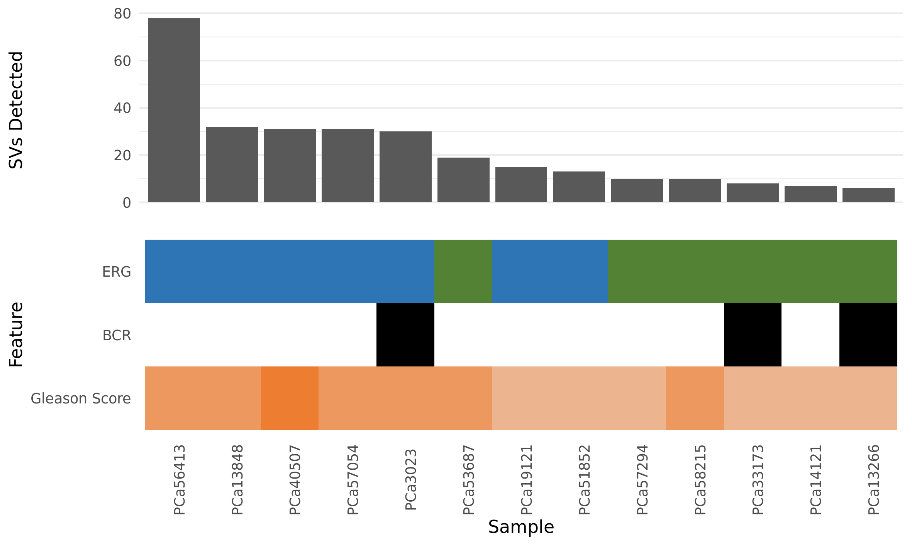

# Summary

This folder contains the breakpoints for structural variants (SVs) called by `hic_breakfinder`.
`inter_expect_1Mb.hg38.txt` and `intra_expect_100kb.hg38.txt` were downloaded from the [Dixon Lab's Box archive](https://salkinstitute.app.box.com/s/m8oyv2ypf8o3kcdsybzcmrpg032xnrgx) on 2019-07-24 (at the time of writing, these files were last updated on 2018-05-22).

## Results

### Structural variants can be detected with `hic_breakfinder`

`hic_breakfinder` identified between 6 and 78 SVs across all 13 samples, using default parameters.
The breakpoint calls can be found in `Breakpoints/Default/`.

Notably, the number of SVs correspond to ERG over-expression.
The 7 ERG over-expressing samples are listed within the top 8 positions ($\mathbb{P}[\text{ERG+ in top 8}] = \frac{\binom{6}{1}}{\binom{13}{6}} = 0.0035$).[^1]

It is also notable that in only 1 sample (`PCa51852`) was the T2E fusion detected, despite the fusion being visible in the contact matrices of all 6 samples with that fusion.

### Differences in structural variant detection is not due to differences in sequencing depth

We hypothesized that the T2E fusion was not being detected in the remaining 5 samples due to differences in read depths, given that `PCa51852` happens to be the sample with the T2E fusion with the most filtered read pairs.

After downsampling `PCa51852` and re-running `hic_breakfinder` with default parameters, the T2E fusion was still detected, suggesting this was not an issue of sequencing depth.
For details, see [`../2019-08-29_breakfinder-subsample/`](../2019-08-29_breakfinder-subsample/).

### Differences in structural variant detection likely stems from detection thresholds

Jesse Dixon created a branch of `hic_breakfinder` that allows a pre-set log-odds ratio threshold to be set with the `--thresh` option.
`Breakpoints/Low_Thresh_*/` contains breakpoints found by running `hic_breakfinder` with the `--thresh` option, to increase the sensitivity to breakpoint calls.

Fixing the threshold at 30, `PCa51852` is still the only sample where the T2E fusion is detected.
Fixing the threshold at 20, `PCa56413` has the T2E fusion detected.
Due to the size of the deleted region leading to the fusion, and the increased detection at a lower log-odds threshold, this suggests that the threshold for reasonably small SVs close to the diagonal is the limiting factor for detecting this SV.

### Refining structural variant calls

To refine the detected SVs for accurate location, we re-ran `hic_breakfinder` with the `--min-1kb` option.
Breakpoints can be found in [`Breakpoints/Min_1kbp/`](Breakpoints/Min_1kbp/).

These detected breakpoints are all the same as the default parameters, with some of the SVs having their resolution reduced from 10 kbp to 1 kbp, except in 1 case in `PCa56413` where two SVs on chr14 were combined into a single event at 1 kbp resolution.

Overall, this refinement of SVs may provide a more accurate location for each detection, but does not identify new variants.

### Manual classification of structural variants

`hic_breakfinder` finds a submatrix that has a local maximum in signal, and returns the row and column coordinates for this submatrix.
It does not indicate what type of structural variant it has detected, however.

[^1]: This is not a hypothesis we were explicitly looking for, in the first place. We have yet to find other independent evidence that suggests ERG over-expression leads to chromosomal instability. We wouldn't have tested for this if this result didn't return anything interesting, so in reality this _p_-value is a likelihood and should include a prior on "how likely we were to test this result".