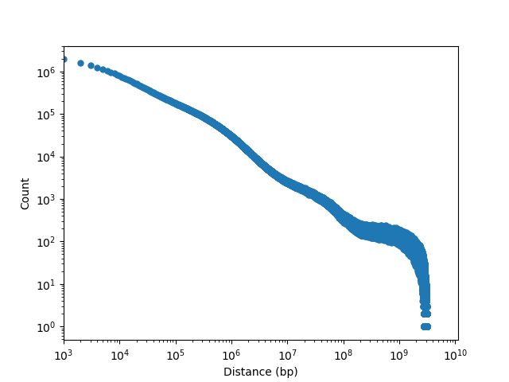

# Summary

This folder contains analysis relating to the degree of contact between gene promoters and enhancers.

## Methods

There are two main methods to address this question.

### Method 1: Read counts from filtered BAMs

### Method 2: Thresholded frequencies from normalized contact matrices

To narrow the bin size to as small as possible while still attempting to keep 1 peak per bin, we use a bin size of 4 kbp.
This is due to the results in `/../2019-05-01_cre-distributions/`.
Each sample has outliers peak sizes above 4 kbp, and non-outliter peak sizes below.
Using this as a threshold size will account for almost all peaks called in each sample.

## Data

We use either the filtered BAM for each sample for Method 1, or the normalzed contact matrix derived from these BAMs for Method 2.

## Results

### Each sample has the same distribution of contacts at a given distance

We consider the number of filtered _cis_ contacts at a given distance to see if there are overall differences in chromatin interconnectedness.
We consider the midpoint of each bin (matrix resolution of 1 kbp) to calculate the distance between contacts.

    
### Gene promoters contact $N = ?$ active enhancers

### Active promoters contact $M = ?$ gene promoters

### Gene promoters contact $L = ?$ other gene promoters
