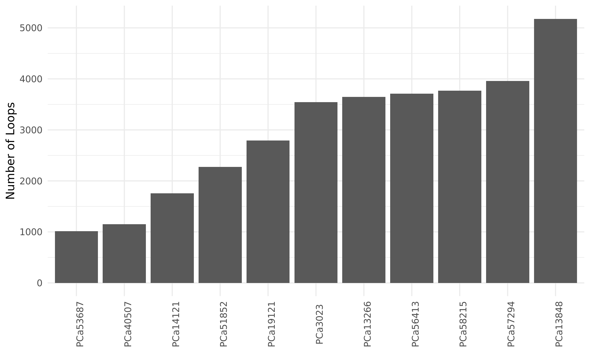

# Summary

This folder contains data related to calling loops from the Low-C data using [cLoops](https://github.com/YaqiangCao/cLoops).

## Results

### Called loops

cLoops requires setting 2 parameters (as it is based on DBSCAN): _eps_ (the distance within which two paired-end tags are classified as neighbours) and _minPts_ (the minimum required number of paired-end tags required to be called a loop).
Running the default command with cLoops allows the program to select a minimum self-ligation distance cutoff after using a set of _eps_ and _minPts_ parameters for the candidate loop detection.
The distance cutoff for each sample, DBSCAN parameters, and the number of loops called are listed in `Loops/loop-stats.tsv` (`Distance_Cutoff` in units of bp).

