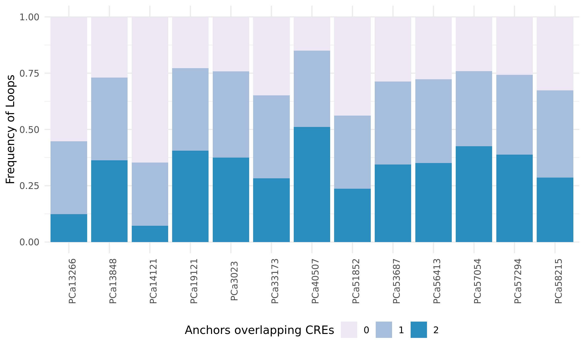
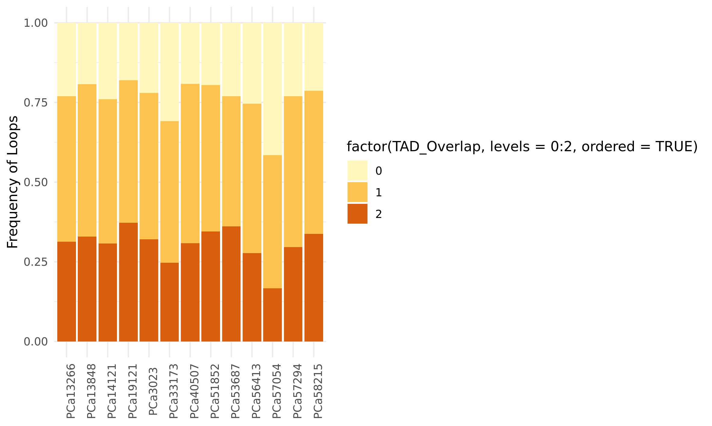

# Summary

This folder contains data related to calling loops from the Low-C data using [cLoops](https://github.com/YaqiangCao/cLoops).

## Results

### Called loops

cLoops requires setting 2 parameters (as it is based on DBSCAN): _eps_ (the distance within which two paired-end tags are classified as neighbours) and _minPts_ (the minimum required number of paired-end tags required to be called a loop).
Running the default command with cLoops allows the program to select a minimum self-ligation distance cutoff after using a set of _eps_ and _minPts_ parameters for the candidate loop detection.
The distance cutoff for each sample, DBSCAN parameters, and the number of loops called are listed in `Loops/loop-stats.tsv` (`Distance_Cutoff` in units of bp).

### Loops overlapping with active cis-regulatory elements

We hypothesize that these loops correspond to promoter-enhancer loops and TAD boundaries, while loops that do not correspond to these features are false detections by `cLoops`.
We start by seeing how many loops have 0, 1, or 2 endpoints overlapping active cis-regulatory elements (CREs; as defined by H3K27ac peaks).
We hypothesize that:

* loops involving 2 active CREs are promoter-enhancer loops (where both are active in prostate cancer)
* loops involving 1 active CREs are promoter-enhancer loops (where the enhancer is poised)
* loops involving 0 active CREs are TAD boundaries

This suggests that many of the loops being called are in fact loops directly involved in promoter-enhancer interactions, but not all.

### Loops overlapping with TAD boundaries

The remaining loops, we hypothesize, overlap TAD boundaries.
We extend the boundary to be a 40 kbp window, and see which loops overlap these extended boundaries.

These numbers are less variable across the samples, likely owing to the roughly equal number of TADs and boundaries called across each sample, whereas the number of H3K27ac peaks spans almost an order of magnitude.

Approximately 25% of loops that do not overlap and CREs do not overlap any TAD boundary.
Conversely, ~ 75% of loops have a boundary as at least one anchor, providing support to the hypothesis that called loops are active _cis_-regulatory interactions and TAD boundaries.

## Conclusions

Less than 10% of called loops, on average, do not coincide with a TAD boundary nor a _cis_-regulatory element, thus suggesting that the called loops are biologically relevant features of the Hi-C data.
