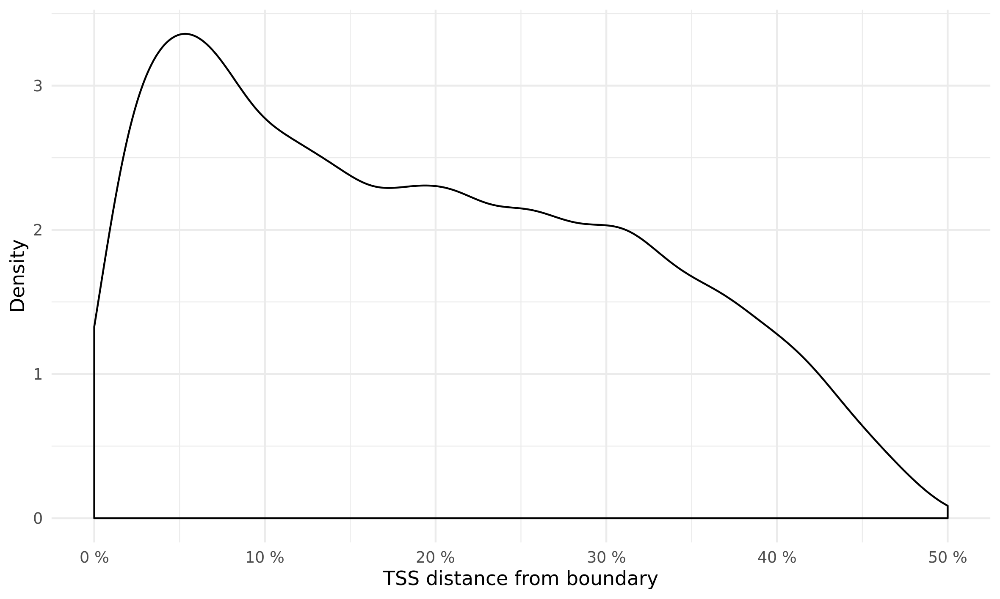
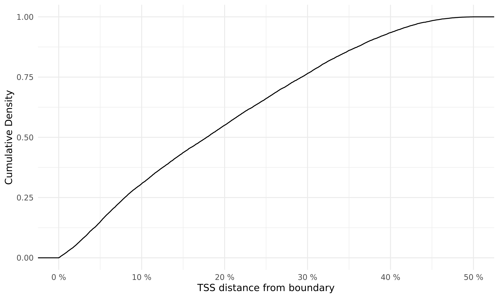
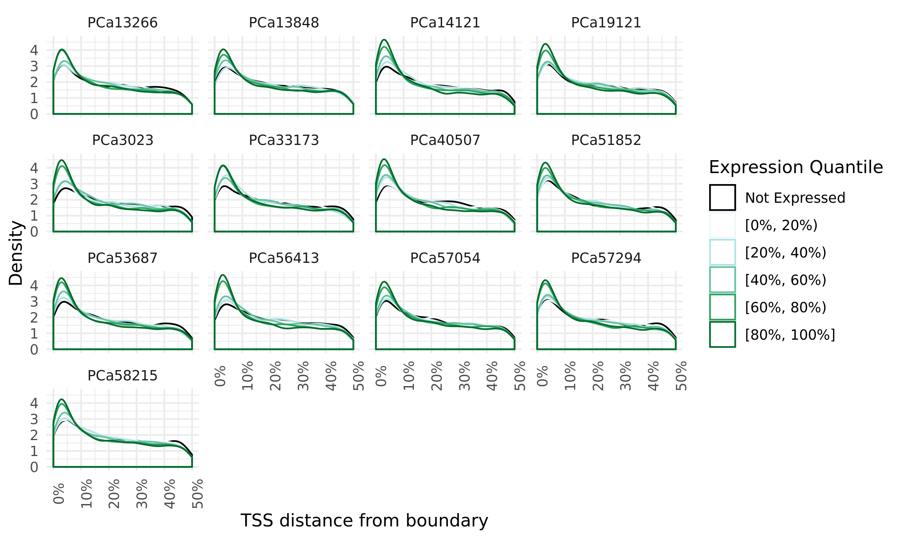
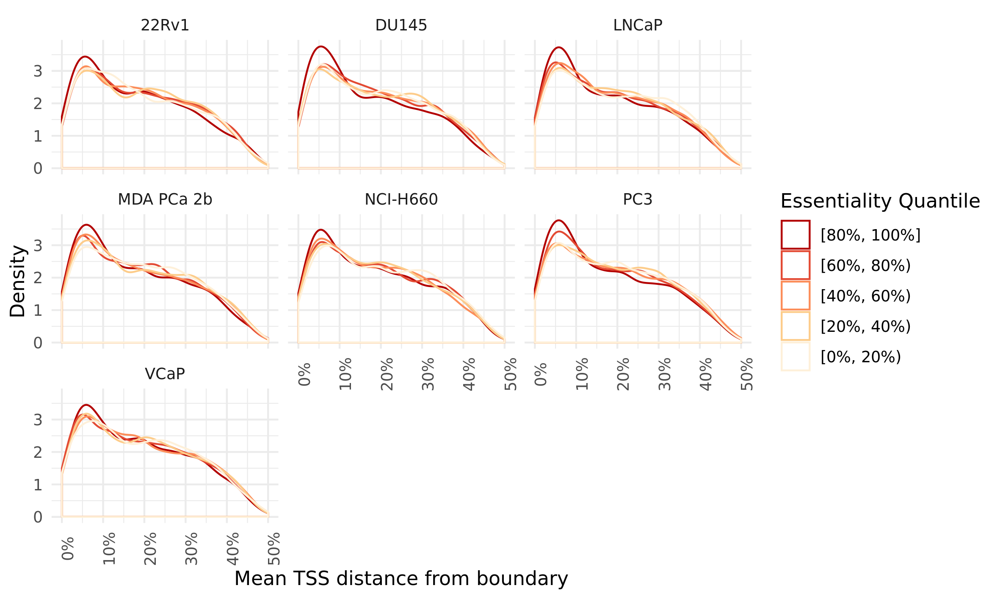
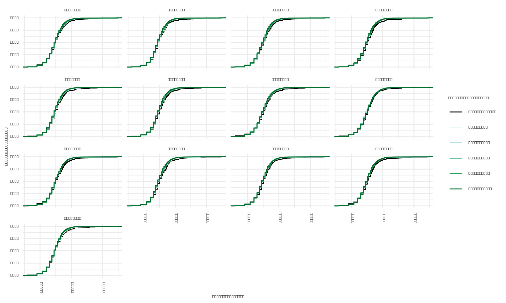

# Summary

Upon earlier inspection of our data, we noticed that the _FOXA1_, _MYC_, and _AR_ genes were all located in close proximity to TAD boundaries in all 13 patients.
The _MYC_ locus is shown below.

These observations aligned with previous literature stating that housekeeping genes were also more frequently located near TAD boundaries [1] and that cohesin binds to DNA near actively transcribed genes [2].
These observations led us to the hypothesis that essential genes for the cell of interest are located near TAD boundaries (i.e. TADs form around these essential genes).

This folder contains the work that attempts to address that hypothesis.

## Materials & Methods

We use the aggregated TAD boundaries from [`../2020-01-15_TAD-aggregation/`](../2020-01-15_TAD-aggregation/) from primary prostate cancer tumours to calculate the distance from gene transcription start sites (TSSs from GENCODE v33).
We also use matched total RNA-seq for these 13 patients from [Chen _et al._, 2019] and gene essentiality data from the [DepMap Project](https://depmap.org)[3] for 7 prostate cancer cell lines to identify genes essential for prostate cancer.

## Results

### Genes are preferentially located near TAD boundaries

As seen below, the locations of TSSs are skewed towards TAD boundaries.
More than 50% of TSSs are located within the first 20% of a TAD, with a mode near 5%.

### Highly expressed genes are preferentially located near TAD boundaries

By stratifying genes according to their expression, we observe that genes with higher expression are more predominantly found near TAD boundaries compared to more lowly-expressed genes.

This is not to say that highly expressed genes are only located near boundaries, just that they are "enriched" near boundaries, compared to other genes.
This fits with previous observations of cohesin being found near highly expressed genes, even in the absence of _Ctcf_ \Cref{Busslinger2017}.

### Highly essential genes are preferentially located near TAD boundaries

Similarly to expression, we can stratify genes by their essentiality, as determined through RNAi screen assays \Cref{McFarland2018}.
And again, similarly to expression, we observe that more essential genes are more predominantly found near TAD boundaries compared to less essential genes.

This is not to say that essential genes are only located near boundaries, just that they are "enriched" near boundaries, compared to other genes, although the enrichment is not as strong as it is for expression.
This fits with previous observations of the enrichment of highly-expressed housekeeping genes near boundaries \Cref{Chen2019}.

### Highly essential genes are not located within differently-sized TADs

Given the enrichment of essential and highly-expressing genes near TAD boundaries, we considered the possibility that this result is confounded by the size of the TADs that contain these genes.

We use the smallest parent TAD containing each gene, calculated previously, to determine whether highly-expressed genes are located within smaller or larger TADs, compared to lowly-expressed genes.
We observe through plotting the empirical cumulative density functions of TAD sizes stratified by essentiality that there is almost no difference in the TAD size distribution, suggesting that TAD size is not a confounding factor in the enrichment of essential and highly-expressed genes near TAD boundaries.

## Conclusions

## References

\Cref{Chen2019} Chen, Ke, Wu, Zhao, _et al._, Nature, 2019. doi: [10.1038/s41586-019-1812-0](https://doi.org/10.1038/s41586-019-1812-0)

\Cref{Busslinger2017} Busslinger _et al._, Nature, 2017. doi: [10.1038/nature22063](https://doi.org/10.1038/nature22063)

\Cref{McFarland2018} James M. McFarland, Zandra V. Ho, Guillaume Kugener, Joshua M. Dempster, Phillip G. Montgomery, Jordan G. Bryan, John M. Krill-Burger, Thomas M. Green, Francisca Vazquez, Jesse S. Boehm, Todd R. Golub, William C. Hahn, David E. Root, Aviad Tsherniak. "Improved estimation of cancer dependencies from large-scale RNAi screens using model-based normalization and data integration". _Nature Communications_ (2018). [doi:10.1038/s41467-018-06916-5](https://doi.org/10.1038/s41467-018-06916-5)
