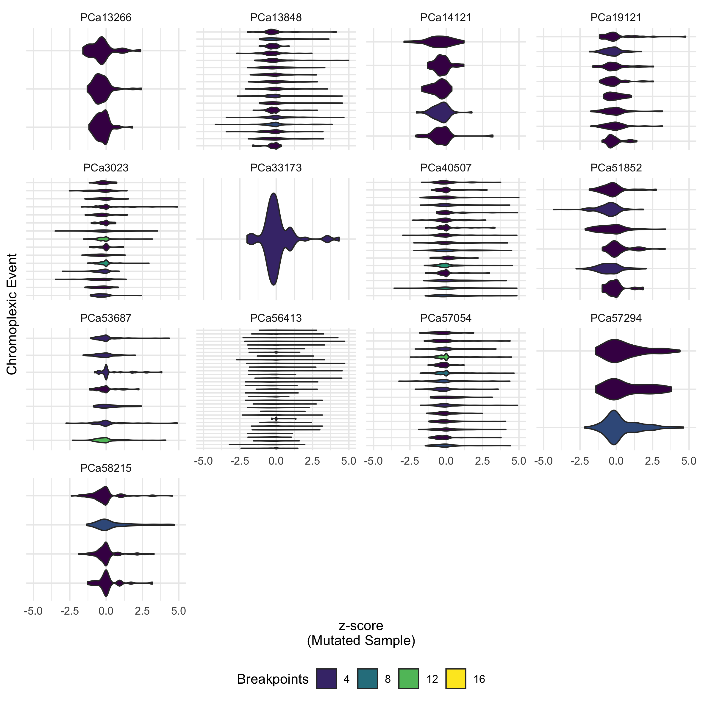

# Summary

When observing the contact matrices, we noted how many events seemed linked together by their location.
This phenomenon of multiple SVs where chromosomal ends are shuffled without leading to copy number losses is termed "chromoplexy", and has previously been observed as particularly common in prostate cancer \Cref{Li2020,Baca2013}.
Here, we explore this phenomenon using our Hi-C data.

## Data

We use the called breakpoints from `hic_breakfinder` in [`../2019-07-24_breakfinder/Breakpoints/Default/`](../2019-07-24_breakfinder/Breakpoints/Default/).
We also make use of the RNA-seq data from these same samples \Cref{Chen2019}, and the TADs we previously called in [`../2020-01-15_TAD-aggregation/`](../2020-01-15_TAD-aggregation/).

## Methods

### Graph construction of SV breakpoints

Similar in design to the ChainFinder algorithm previously described \Cref{Baca2013}, we represent each breakpoint as a node in a graph.
Each row of the `hic_breakfinder` output contains a pair of breakpoints corresponding to the bounding coordinates of the aberrant submatrix.
These two nodes are connected via an edge, coloured according to the breakpoint type assigned to it by manual annotation (see the `Type` column in [`../2019-07-24_breakfinder/Breakpoints/Default/PCa*.breaks.sorted.manually-resolved.tsv`](../2019-07-24_breakfinder/Breakpoints/Default/)).
Breakpoints are subsequently connected with an edge if they are within 100 kbp of each other.
This tolerance distance was chosen due to the granularity of the breakpoint calls, since each breakpoint pair is identified at a contact matrix resolution of 10 kbp or 100 kbp.
This produces a graph of SV breakpoints for each patient, where every connected component of the graph is a chromoplexic event.

### Hypothesis testing for differences in RNA abundance

Conventional methods for differential gene expression, such as DESeq2 \Cref{Love2014}, EdgeR \Cref{Robinson2010}, and Sleuth \Cref{Yi2018} require replicates for each condition being tested.
For our case of comparing a sample with an SV to samples without, recurrent events are rare, thus leading to 1-vs-many comparisons, which is insufficient for these previous methods.

To address this shortcoming, we developed a different null hypothesis testing framework by aggregating genes in TADs containing the SV breakpoints (implemented in [`test-dge.py`](test-dge.py)).

1. For each breakpoint, identify the overlapping TAD(s).
  In the case of an insertion, it may be a single TAD; in the case of a large deletion, it may be many.
2. Identify all genes lying within these affected TADs, according to the GENCODE v33 reference \Cref{GENCODE}.
3. Perform a z-transformation on the abundance values (in FPKM) for these genes, given by
  $$
  z_i = \frac{x_{i,mut} - \mu_{i,non-mut}}  {\sigma_{i,non-mut}}
  $$
  Under the null hypothesis, that these linked breakpoints do not affect the expression of the nearby genes within the same TADs, the random variable for the expression of gene is distributed like the non-mutant samples, namely
  $$
  \mathbb{E}[X_{i,mut}] = \mu_{i,non-mut}
  $$
  $$
  \text{Var}[X_{i,mut}] = \sigma^2_{i,non-mut}
  $$
  Thus, each gene's z-score should come from a distribution with mean 0 and standard deviation 1.

3. For each set of related genes, perform a two-sided t-test on these z-scores.

## Results

### Chromplexy is common and more frequent in _T2E_-fusion patients

### Chromoplexy alters the expression of genes within TADs containing breakpoints

Using the method described above, we identified $n$ chromoplexic events that significantly altered gene expression of genes within the same TADs as the linked breakpoints.

While most genes did not have a large change to their expression, we observed that approximately one third (33.1%) of all genes had fold changes greater than 2.

## Conclusions

