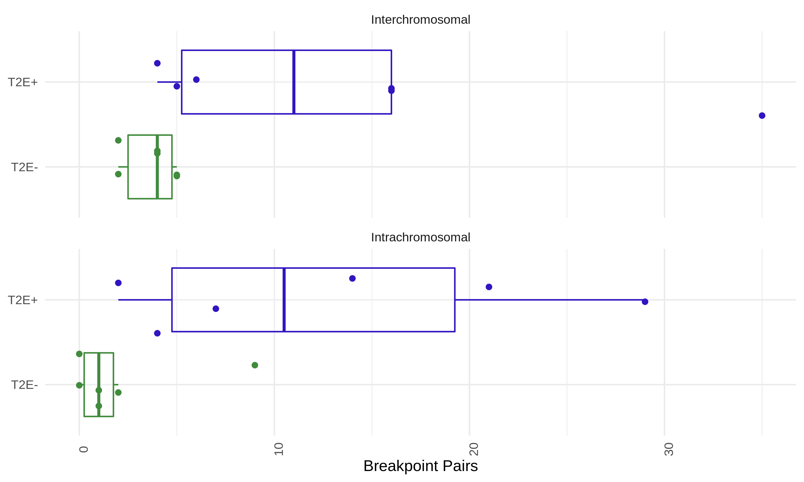
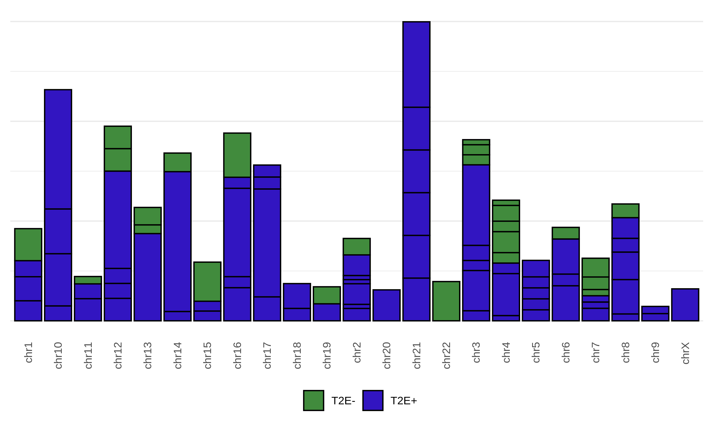

# Summary

When observing the contact matrices, we noted how many events seemed linked together by their location.
This phenomenon of multiple SVs where chromosomal ends are shuffled without leading to copy number losses is termed "chromoplexy", and has previously been observed as particularly common in prostate cancer (see [Li _et al._, 2020](https://doi.org/10.1038/s41586-019-1913-9) and [Baca _et al._, 2013](https://doi.org/10.1016/j.cell.2013.03.021).
Here, we explore this phenomenon using our Hi-C data.

## Data

We use the called breakpoints from `hic_breakfinder`.

## Methods

### Graph construction of SV breakpoints

Similar in design to the ChainFinder algorithm previously described in Baca _et al._, 2013, we represent each breakpoint as a node in a graph.
Each row of the `hic_breakfinder` output contains a pair of breakpoints corresponding to the bounding coordinates of the aberrant submatrix.
These two nodes are connected via an edge, coloured according to the breakpoint type assigned to it by manual annotation (see the `Type` column).
Breakpoints are subsequently connected with an edge if they are within 100 kbp of each other.
This tolerance distance was chosen due to the granularity of the breakpoint calls, since each breakpoint pair is identified at a contact matrix resolution of 10 kbp or 100 kbp (most breakpoints called at 1 Mbp resolution appear to be a false positive due to effects of compartmentalization).
This produces a graph of SV breakpoints for each patient, where every connected component of the graph (i.e. sets of inter-connected breakpoints) is a complex event.

## Results

### Structural variant events are more common in T2E+ patients than T2E- patients

In total we detect a median of 15 unique breakpoints (range 3-95) and 7.5 total events (range 1-36) per patient.
We also observed that the T2E+ patients harboured more SVs than T2E- patients (median 17 for T2E+, 4.5 for T2E-, one-sided Mann-Whitney U test, p = 6.22e-3).

This is due to a combination of increased inter- and intra-chomosomal breakpoints merging, individually.

This is present across the entire genome, not just on chr21.

## Conclusions

Merging redundant breakpoint calls demonstrates the amount of complex structural variants in these samples.
Moreover, it highlights the difference in mutational load between T2E+ and T2E- prostate cancer patients.
