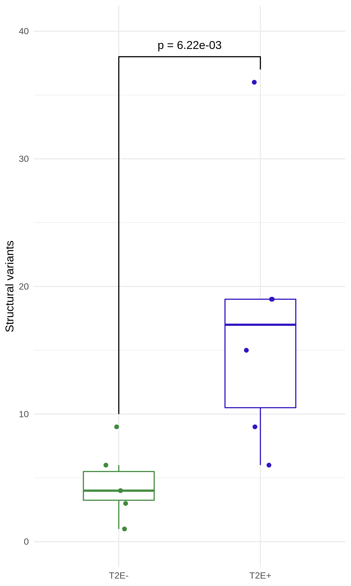

# Summary

When observing the contact matrices, we noted how many events seemed linked together by their location.
This phenomenon of multiple SVs where chromosomal ends are shuffled without leading to copy number losses is termed "chromoplexy", and has previously been observed as particularly common in prostate cancer \Cref{Li2020,Baca2013}.
Here, we explore this phenomenon using our Hi-C data.

## Data

We use the called breakpoints from `hic_breakfinder` in [`../2019-07-24_breakfinder/Breakpoints/Default/`](../2019-07-24_breakfinder/Breakpoints/Default/).
We also make use of the RNA-seq data from these same samples \Cref{Chen2019}, and the TADs we previously called in [`../2020-01-15_TAD-aggregation/`](../2020-01-15_TAD-aggregation/).

## Methods

### Graph construction of SV breakpoints

Similar in design to the ChainFinder algorithm previously described \Cref{Baca2013}, we represent each breakpoint as a node in a graph.
Each row of the `hic_breakfinder` output contains a pair of breakpoints corresponding to the bounding coordinates of the aberrant submatrix.
These two nodes are connected via an edge, coloured according to the breakpoint type assigned to it by manual annotation (see the `Type` column in [`../2019-07-24_breakfinder/Breakpoints/Default/PCa*.breaks.sorted.manually-resolved.tsv`](../2019-07-24_breakfinder/Breakpoints/Default/)).
Breakpoints are subsequently connected with an edge if they are within 100 kbp of each other.
This tolerance distance was chosen due to the granularity of the breakpoint calls, since each breakpoint pair is identified at a contact matrix resolution of 10 kbp or 100 kbp (most breakpoints called at 1 Mbp resolution appear to be a false positive due to effects of compartmentalization).
This produces a graph of SV breakpoints for each patient, where every connected component of the graph (i.e. sets of inter-connected breakpoints) is a complex event.

## Results

### Structural variant events are more common in T2E+ patients than T2E- patients

### Complex SVs are common in prostate cancer and more frequent in _T2E_-fusion patients

Each connected component of the breakpoint graphs is a set of related breakpoints as a part of a complex event.
A table with the number of connected components for each sample can be found in [`Statistics/breakpoint-components.tsv`](Statistics/breakpoint-components.tsv).

Complex events are components with > 2 connected breakpoints, and complex events are found in 8/12 patients.
Like with the number of breakpoints detected, the T2E samples tend to have larger numbers of breakpoints involved in complex events.

## Conclusions

Merging redundant breakpoint calls demonstrates the amount of complex structural variants in these samples.
Moreover, it highlights the difference in mutational load between T2E+ and T2E- prostate cancer patients.
