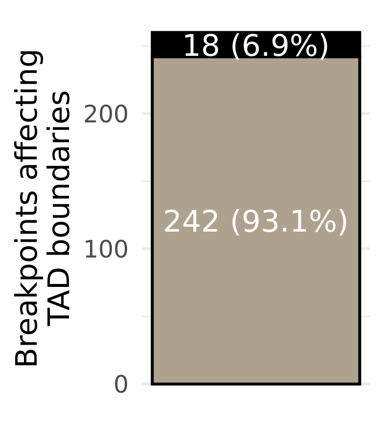

# Summary

This folder contains code and analyses for testing which structural variant breakpoints lead to altered local TAD boundaries.

## Data

We used the resolved breakpoints from [`../2020-02-19_chromoplexy/Graphs/`](../2020-02-19_chromoplexy/Graphs/), which have had redundant calls merged together.
We also use aggregated TAD calls from [`../2020-01-15_TAD-aggregation/resolved-TADs/`](../2020-01-15_TAD-aggregation/resolved-TADs/).

## Methods

### Detecting SV breakpoints that alter local chromatin topology

We consider each breakpoint end from each SV detected.
For each breakpoint at locus $[s, e)$ in a given patient, we look for other patients that have a breakpoint end within 500 kbp (i.e. overlapping $[s - \delta, e + \delta), \delta = 500 000$) to identify similarly mutated patients.
A local BPscore \Cref{Zaborowski2019} is calculated for the identified TADs within this $[s - \delta, e + \delta)$ window for each pair of samples.
Using these calculations, we use two approaches for determining whether there is an alteration of the local topology; one binary classification method, and one permutation test method.

#### Binary classification of local topology

Patients are assigned into one of two groups using hierarchical clustering with the matrix of pairwise BPscore values as a distance matrix.
If the clustering equals the mutated samples from the non-mutated samples (i.e. the clustering matches the mutation status in this locus), then the local topology is counted as altered as a result of the SV.

#### Permutation test for differences in local topology

#### TADsplimer

## Results

### Breakpoints rarely alter the local chromatin topology

Using the method described above for detecting changes to local topology as a result of and SV breakpoint, we find that a small minority of SVs alter the local topology (18 / 260, 6.9%).

SVs that do alter the local topology include:

* a translocation of the deleted _TMPRSS2_-_ERG_ locus being inserted into chr14 in `PCa13848`
* multiple complex events on chr4 of `PCa3023`
* a translocation of a deleted segment on chr12 and inserted into chr17 in `PCa3023` near _NCOR1_, _TTC19_, and _SNORD163_
* one end of a tandem duplication on chr3 in `PCa53687` by _GAP43_
* a complex, indeterminate event on chr15 in `PCa53687`
* an apparent chromosome arm swap between chr7 and chr19 in `PCa53687`
* multiple chained events on chr3 of `PCa56413`
* a duplication on chr10 of `PCa56413`

There was no event detected where both breakpoints in a pair altered the local topology.
If SVs are altering gene expression, it is likely not through establishing or altering TAD boundaries, but by interfering with _cis_-regulatory interactions through other means.

## Conclusions

Similar to previous reports, we find that few structural variant breakpoints have the capacity to alter local chromatin topology.
This analysis is limited due to the type of methodology for testing for TAD changes, as well as the subclonality that is present of these mutation in the ensemble sequencing data.
Single cell approaches may provide new evidence in this area, however, for now it appears that structural variants have the potential to, but often do not, alter topology.
