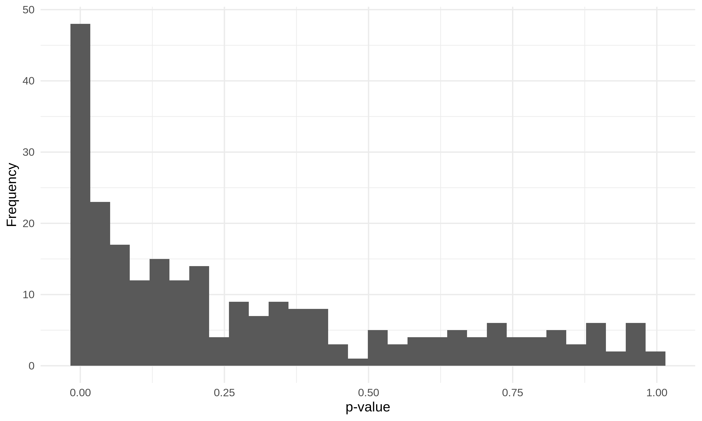
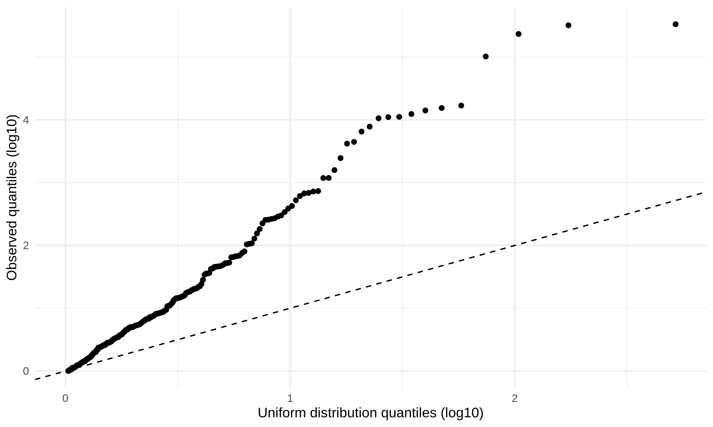
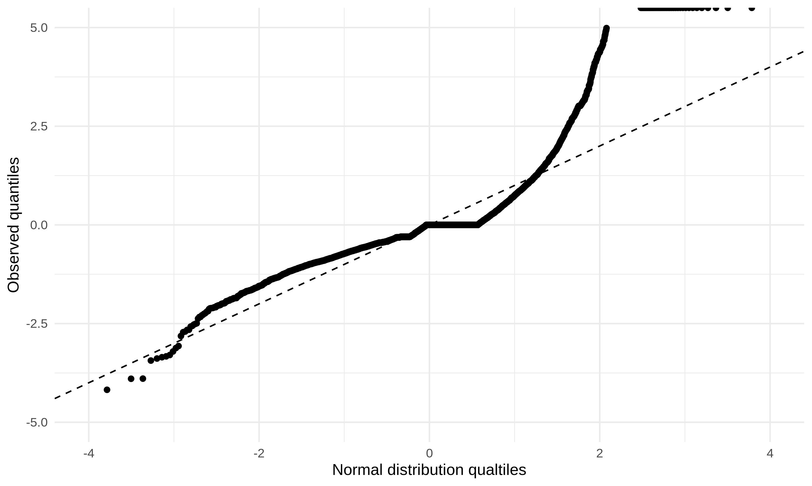
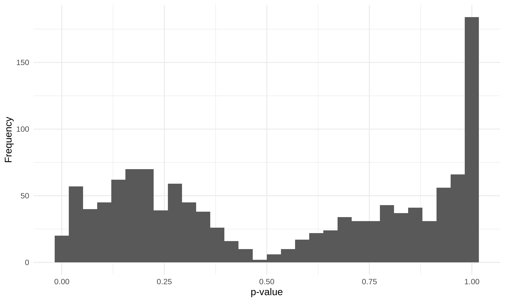
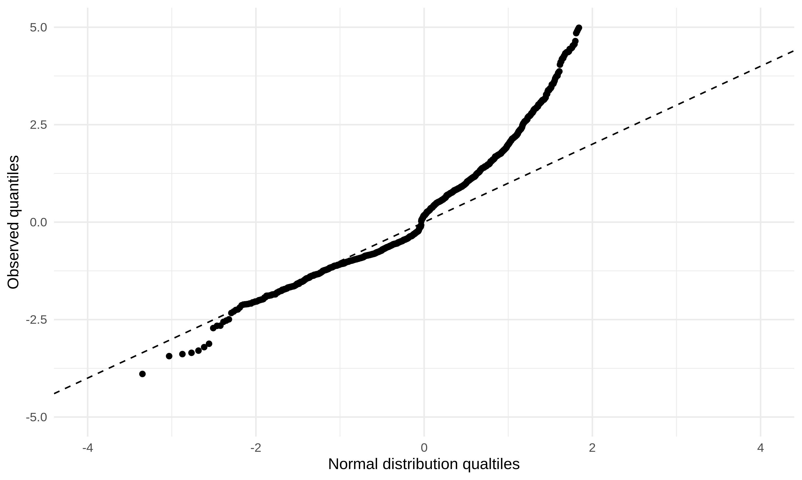
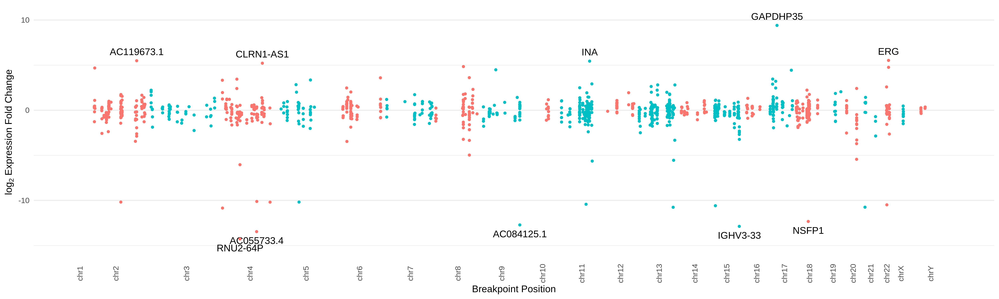

# Summary

This folder contains code and analyses for testing which structural variant breakpoints lead to altered local gene expression.

## Data

We used the resolved breakpoints from [`../2020-02-19_chromoplexy/Graphs/`](../2020-02-19_chromoplexy/Graphs/), which have had redundant calls merged together.
We also use aggregated TAD calls from [`../2020-01-15_TAD-aggregation/resolved-TADs/`](../2020-01-15_TAD-aggregation/resolved-TADs/).
We use the pre-processed gene expression data from [`../../Data/External/CPC-GENE/CPC-GENE_Chen-2019_RNAseq_rsem_gene_FPKM.13-LowC-only.tsv`](../../Data/External/CPC-GENE/CPC-GENE_Chen-2019_RNAseq_rsem_gene_FPKM.13-LowC-only.tsv).

## Methods

### Hypothesis testing for differences in RNA abundance

Conventional methods for differential gene expression, such as DESeq2 \Cref{Love2014}, EdgeR \Cref{Robinson2010}, and Sleuth \Cref{Yi2018} require replicates for each condition being tested.
For our case of comparing a sample with an SV to samples without, recurrent events are rare, thus leading to 1-vs-many comparisons, which is insufficient for these previous methods.

To address this shortcoming, we developed a different null hypothesis testing framework by aggregating genes in TADs containing the SV breakpoints (implemented in [`altered-expression.py`](altered-expression.py)).

1. For each breakpoint, identify the overlapping TAD(s).
2. Identify other samples with an SV breakpoint nearby the current breakpoint.
3. Identify all genes lying within these affected TADs, according to the GENCODE v33 reference \Cref{GENCODE}.
4. Perform a z-transformation on the abundance values (in FPKM) for these genes, given by

    $$
    z_i = \frac{\bar{x}_{i,mut} - \bar{x}_{i,non-mut}}  {\sigma_{i,non-mut}}
    $$
    Under the null hypothesis, that these linked breakpoints do not affect the expression of the nearby genes within the same TADs, the random variable for the expression of gene is distributed   like the non-mutant samples, namely
    $$
    \mathbb{E}[X_{i,mut}] = \mu_{i,non-mut}
    $$
    $$
    \text{Var}[X_{i,mut}] = \sigma^2_{i,non-mut}
    $$
    Thus, each gene's z-score should come from a distribution with mean 0 and standard deviation 1.

5. For each set of related genes, perform a two-sided t-test on these z-scores.

## Results

### Possible pitfalls of hypothesis testing framework due to lack of recurrent SVs

We are aware that using n = 1 in a single test group can be a dangerous statistical game to play, with the lack of variance estimation for the mutated group.
However, due to the lack of recurrent structural variants, the only case where having adequate sample sizes is in the case of the T2E fusion, where we have 6 samples in each test group.
The remaining test cases involve a single mutated sample compared against 8 or more samples that are not mutated.
For these cases, we take an approach similar in style to that of DESeq when one contrasting category has only 1 sample by using the estimators of the non-mutated samples as estimates for the mutated sample, as well (see [Working partially without replicates](https://bioconductor.org/packages/release/bioc/vignettes/DESeq/inst/doc/DESeq.pdf) from the DESeq v1 package).

Looking at the histogram of p-values, we find an anti-conservative distribution.

However, looking at the qq-plot shows that these p-values are likely over-inflated, since they even do not behave well at larger p-values.

While there may be true detections here, the consistent over-inflation of p-values here implies that many of these measures of altered expression at the breakpoint level are likely to be false positives.

Looking at the distribution of gene-wise z values, we can see a similar distribution.

And this over-inflation is not solely due to lowly-expressing genes with large fold-changes.
If we threshold on a minimum absolute difference between mutated and non-mutated samples (> 1e-3 FPKM), we see the following distributions.

There are some cases for optimism, however.
We see that _ERG_ is found to be significantly over-expressed, which has been previously observed.

But this may be the exception to the rule.

### Structural variant breakpoints alter the expression of genes within surrounding TADs

Using the method described above, we identified 41 breakpoints that significantly altered gene expression of genes within the same TAD(s) ($FDR < 0.05$).

While most genes did not have a large change to their expression, we observed that approximately one third (31.3%) of all genes had fold changes greater than 2 (i.e. $\log_2(\text{fold change}) \ge 1$)

We find the following distribution of genes' expression z-scores:

As expected, we identifu _ERG_'s over-expression resulting from the T2E fusion.
_GAPDHP35_ is the gene with the largest z-score ($z \approx 330$, $\log_2(\text{fold change}) \approx 9.485$), although its expression in the mutated and non-mutated samples is low (expression < 2 FPKM for all samples).
Thus, it appears that this methodology is prone to false positives from lowly-expressing genes.

To reduce these false positives (producing large fold-changes and z-scores, despite not having large absolute changes in expression), we consider the absolute change in RNA abundance, $|\bar{x}_{mut} - \bar{x}_{non-mut}|$.
We see that the majority of genes with large fold changes have small absolute differences in read abundances between the mutated and non-mutated samples (2758/3155 genes with $|\log_2(\text{fold change})| \ge 1$ have $|\bar{x}_{mut} - \bar{x}_{non-mut}|$ < 1 FPKM, 87.4%).

We see that the percentage of breakpoints affecting expression is still non-zero when only considering these genes with non-negligible differences in read counts (absolute change to be $\ge 1$ FPKM), but drops to about one fifth (20.8%).

## Conclusions

These statistical tests show that this testing framework is prone to false detections, and should be treated cautiously.

SV breakpoints do not appear to disrupt local TAD boundary formation, often.
While this and previous work shows examples where these SVs do in fact rearrange TADs, this does not appear to be the norm.
However, these breakpoints still manage to affect the expression of the genes within these TADs.
Thus, we hypothesize that these SVs do not alter gene expression by reorganizing TADs, but through affecting _cis_-regulatory interactions themselves.
