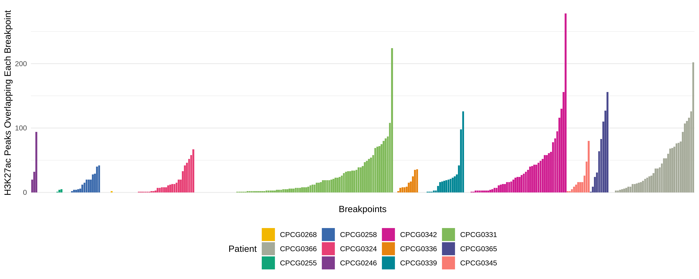
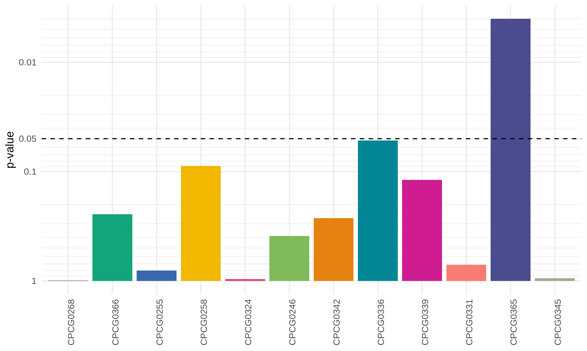

# Summary

This folder contains results attempting to address a question about whether structural variants operate or function by rearranging _cis_-regulatory elements.
We see that SVs, while rarely altering TAD boundaries, often result in changes to local gene expression.
We hypothesize that SVs create a selective advantage for these cells through altering the regulatory networks for these genes.

## Results

### Are enhancer elements contained within SV breakpoints moreso than expected?

From anecdotal observation, we see that breakpoints often overlap H3K27ac peaks.
A systematic search revealed that 62 / 317 unique breakpoints do not overlap any H3K27ac peaks, while the remainder do, and often overlap multiple peaks.

We hypothesized that, if SVs were altering local gene expression without affecting TADs, that SV breakpoints should be enriched with enhancer elements, for which we can use H3K27ac peaks as a proxy.
We perform a permutation test to identify whether there are more H3K27ac peaks in identified breakpoints than expected, matched to the patients (this permutation method only includes the masked hg38 genome and excludes ENCODE blacklist regions, see [`permutation.R`](permutation.R)).

We find that only PCa53687 has a significantly larger number of H3K27ac peaks in its breakpoints than expected, but this does not survive multiple testing.

