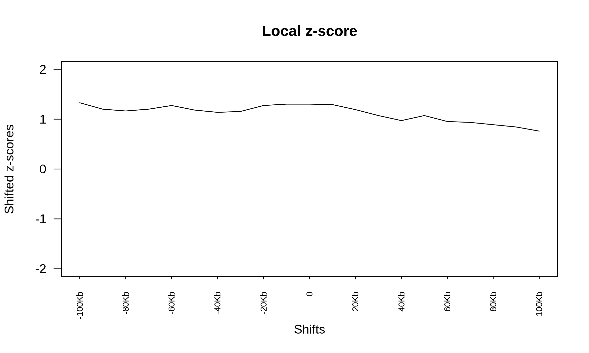

# Summary

This folder contains results attempting to address a question about whether structural variants operate or function by rearranging _cis_-regulatory elements.
We see that SVs, while rarely altering TAD boundaries, often result in changes to local gene expression.
We hypothesize that SVs are not randomly located throughout the genome.
To function by altering _cis_-regulatory interactions between regulatory elements and genes, we hypothesize that SV breakpoints are enriched in element-dense regions, so as to maximize their potential impact.

## Data

We use H3K27ac peaks to demarcate active regulatory elements, and combine these peaks with the Hi-C-identified SV breakpoints.

## Methods

We use the permutation testing framework from the [`regioneR` R package](https://bioconductor.org/packages/release/bioc/vignettes/regioneR/inst/doc/regioneR.html#session-info).

## Results

### SV breakpoints are not enriched for active regulatory elements

From anecdotal observation, we see that breakpoints often overlap H3K27ac peaks.
A systematic search revealed that 62 / 317 unique breakpoints do not overlap any H3K27ac peaks, while the remainder do, and often overlap multiple peaks.

We perform a permutation test to identify whether there are more H3K27ac peaks in identified breakpoints than expected, matched to the patients (this permutation method only includes the masked hg38 genome and excludes ENCODE blacklist regions, see [`permutation.R`](permutation.R)).

We find that only `PCa53687` has a significantly larger number of H3K27ac peaks in its breakpoints than expected.

However, like the other samples, this enrichment in the number of peaks is not sensitive to the precise breakpoint locations, as can be seen in this local sensitivity plot.

If the locations were precisely dependent on the breakpoint locations, there would be a large spike in around 0 in the above plot, but that is not the case.

## Conclusions

While there is a statistically significant result for this one patient, the lack of signficant enrichment for the remaining patients and the lack of location sensitivity for all patients does not support the hypothesis that breakpoints are locatws around genomic regions that are dense with active _cis_-regulatory elements.
