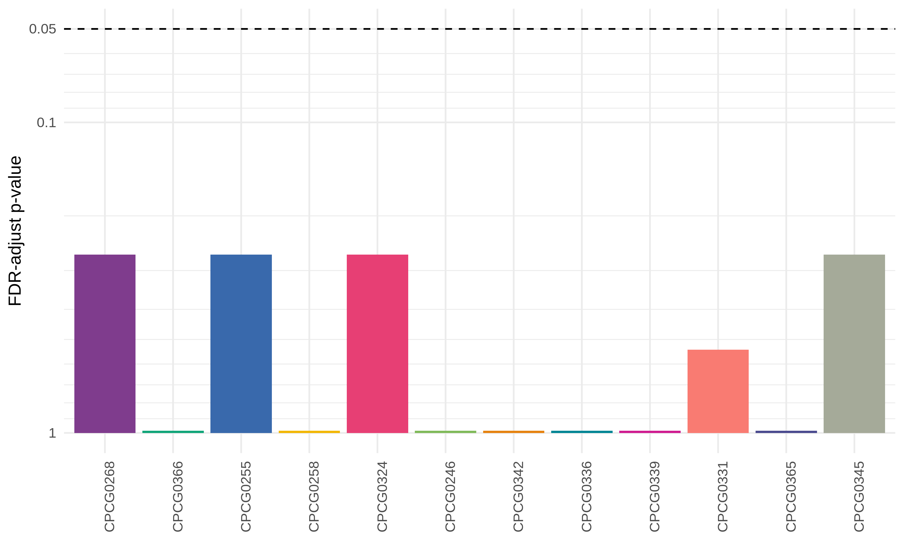
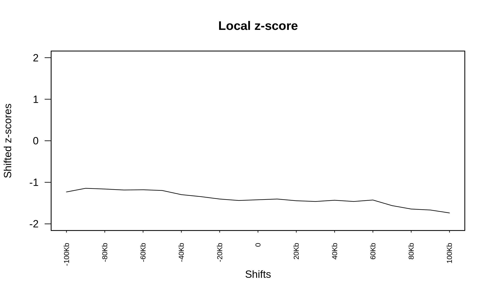

# Summary

Previously, we have shown that SVs, while rarely altering TAD boundaries, often result in changes to local gene expression.
Moreover, while we hypothesizes that SV breakpoints would occur in regulatory element-dense regions of the genome to maximize their likely impact, we did not find evidence in that direction (see [`../2020-06-05_breakpoint-peak-enrichment/`](../2020-06-05_breakpoint-peak-enrichment/)).
We wondered whether, like SNVs, SV breakpoints occur randomly throughout the genome, or may be more prone to occur in inaccessible chromatin, due to the reduced operation capacity of DNA repair machinery in these regions

## Data

We use the TCGA prostate adenocarcinoma ATAC-seq peak catalogue, and combine these peaks with the Hi-C-identified SV breakpoints.

## Methods

We use the permutation testing framework from the [`regioneR` R package](https://bioconductor.org/packages/release/bioc/vignettes/regioneR/inst/doc/regioneR.html#session-info).

## Results

We perform a permutation test to identify whether there are more ATAC-seq peaks in identified breakpoints than expected, matched to the patients (this permutation method only includes the masked hg38 genome and excludes ENCODE blacklist regions, see [`permutation.R`](permutation.R)).

We find that no patient has a significantly larger number of ATAC-seq peaks in its breakpoints than expected, similar to the result from [`../2020-06-05_breakpoint-peak-enrichment/`](../2020-06-05_breakpoint-peak-enrichment/).

We can also test for sensitivity of the precise positions of the breakpoints, however, we again do not find any peak in the enrichment.

## Conclusions

Due to the lack of enrichment and sensitivity to location, we fail to reject the hypothesis that SV breakpoint are distributed randomly throughout the genome, with respect to chromatin accessibility.
This, and the lack of evidence from [`../2020-06-05_breakpoint-peak-enrichment/`](../2020-06-05_breakpoint-peak-enrichment/), it is plausible that these analyses are not adequate, due to the size of the breakpoint calls from Hi-C.
Properly addressing these questions may require a more localized breakpoint detection method.
