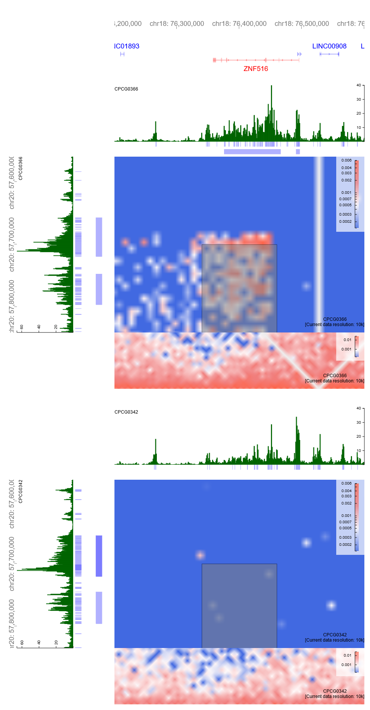

# Summary

In previous results, we found that structural variants, despite not affecting local topology, still are associated with changes in gene expression.
This led to the hypothesis that structural variants "function" by altering _cis_-regulatory networks of nearby genes (e.g. enhancer hijacking).
Other groups have shown that this can happen, such as [Lupianez _et al._, Cell, 2015](https://doi.org/10.1016/j.cell.2015.04.004).

We demonstrate that this process occurs in prostate cancer. but through a possibly novel mechanism.

## Results

We hypothesize that the altered expression is a result of altered regulatory interactions.
To view this, we can look at the H3K27ac in the breakpoints.

Here, we find 2 instances where it appears that the breakpoint is associated with a novel super-enhancer, characterized by the increased H3K27ac compared to non-mutated samples.

