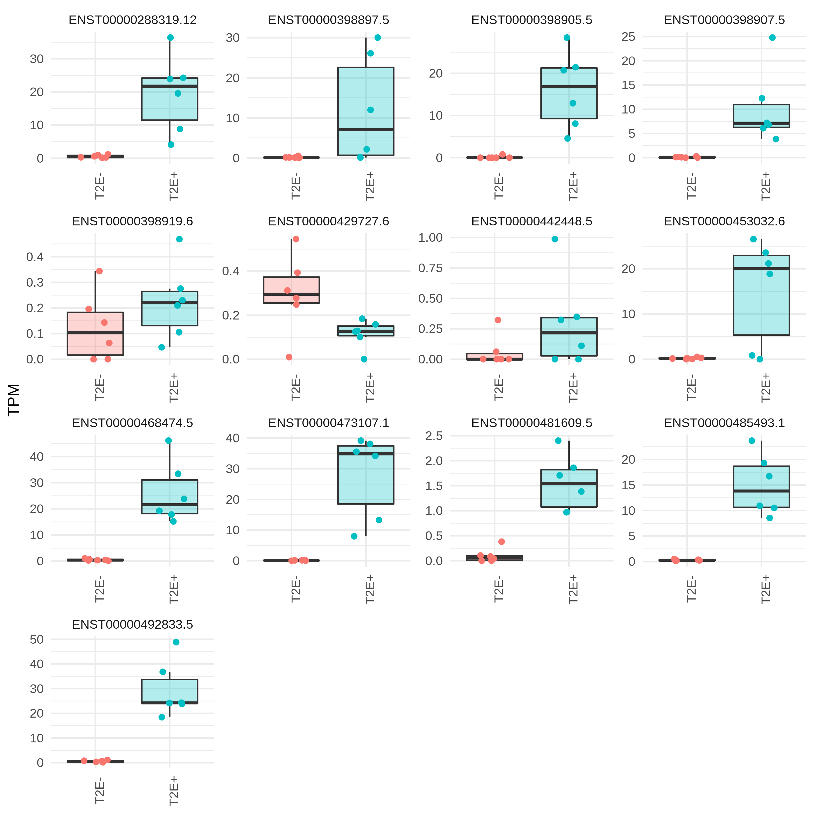

# Summary

This folder contains differential expression analysis related to structural variant disruption.
It is similar in scope to the results in [`../2020-02-19_sv-disruption-expression/`](../2020-02-19_sv-disruption-expression/), except that this folder uses raw RNA-seq counts after using Kallisto to align the FASTQs to the hg38 reference genome.
The previous folder used processed FPKM values after using Bowtie2 on the hg19 reference genome + RSEM to quantify gene counts, and was not directly comparable to our other hg38 results.

## Data

Using the raw RNA-seq FASTQ files from [Chen, Huang, Xu, Livingstone, Soares, _et al._, Cell, 2019](https:/doi.org/10.1016/j.cell.2019.01.025), we performed transcript quantification with Kallisto:

```shell
kallisto quant -t 8 -i homo_sapiens/transcriptome.idx --pseudobam --rf-stranded --bias -o {outdir} -b 100 {mate1} {mate2}
```

## Methods

Similarly to [`../2020-02-19_sv-disruption-expression/`](../2020-02-19_sv-disruption-expression/), conventional methods for differential gene expression require replicates for each condition being tested.
For our case of comparing a sample with a structural variant to samples without, recurrent events are rare, thus leading to 1-vs-many comparisons, which is insufficient for these previous methods.
We devise a method to perform these comparisons of expression between groups where the "mutated" group has only 1 sample, knowing that dispersion estimation is not necessarily accurate for the "mutated" group in this setting.

There are two breakpoints, however, that are properly balanced between the "mutated" and "non-mutated" groups.
These are the breakpoints at either end of the _T2E_ fusion event.
We first perform conventional differential analysis for these two loci, then use these comparisons to benchmark the method for the $n = 1$ mutated cases.

### _T2E_ fusion differential expression

Comparing the _T2E_+/- samples, we can look at the differentially expressed genes between these two groups, as a baseline.
As exprected, we find _ERG_ as the most significantly differentially expressed gene (qval < 2.2e-16), and almost all of its transcripts are greatly increased in expression.


