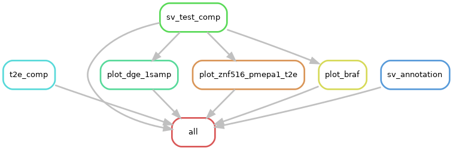

# Summary

This folder contains differential expression analysis related to structural variant disruption.
It is similar in scope to the results in [`../2020-02-19_sv-disruption-expression/`](../2020-02-19_sv-disruption-expression/), except that this folder uses raw RNA-seq counts after using Kallisto to align the FASTQs to the hg38 reference genome.
The previous folder used processed FPKM values after using Bowtie2 on the hg19 reference genome + RSEM to quantify gene counts, and was not directly comparable to our other hg38 results.

## Materials & Methods

Using the raw RNA-seq FASTQ files from [Chen, Huang, Xu, Livingstone, Soares, _et al._, Cell, 2019](https:/doi.org/10.1016/j.cell.2019.01.025), we performed transcript quantification with Kallisto:

```shell
kallisto quant -t 8 -i homo_sapiens/transcriptome.idx --pseudobam --rf-stranded --bias -o {outdir} -b 100 {mate1} {mate2}
```

The scripts for this folder are distributed across a few Rscripts.



## Results

The T2E fusion is well-balanced, with 6 samples per mutation group.
We can calculate differential gene expression, which is done in `t2e-dge.R`.
Results from that analysis can be found in `t2e-comparison.genes.tsv` and `t2e-comparison.transcripts.tsv`.

For all other SVs, no samples share SVs.
As in, the mutated group has a size of $$n = 1$$ and the wild-type group has a size of 11.

The differential analysis is performed in `1sample-dge.sleuth.R`.

## Conclusions

Differential gene expression occurs around SV breakpoints.
