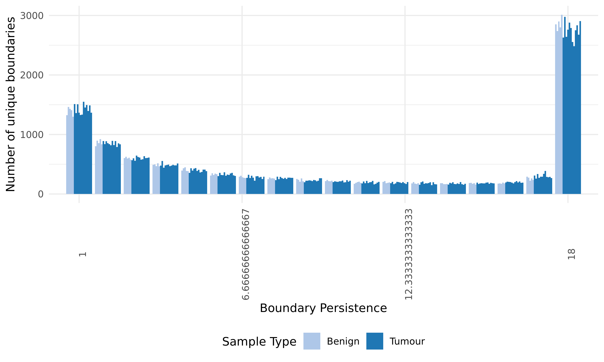

# Topologically associated domains

This folder contains the hierarchical domains called by TopDom for all 17 prostate samples and other cell lines.

We use TopDom[^1] (in `topdom.R`) to call topologically associated domains (TADs) using a set of window size parameters to give a hierarchical view of domain organization.

## Motivation

Despite the conclusions from multiple review papers stating that TopDom is robust to sequencing depth, we find that TAD calls between the benign and tumour samples without adjusting for sequencing depth are affected by this feature of the data.

To compare these cases in a way that removes this confounding variable, we downsample each file to the same number of contacts, then compare them.

## Methods

We still use TopDom to identify TADs, but first we downsample cooler files first.
Using a contact matrix at a resolution of 40 kbp, we use a set of values for the window parameter ($w \in [3, 30]$) to detect TADs across a variety of length scales.

## Results

### Finding downsampling parameters

The number of contacts in each cooler file is as follows:

| Sample Group           | Min       | Median    | Max        |
| ---------------------- | --------- | --------- | ---------- |
| Primary benign         | 310397759 | 385398277 | 394684060  |
| Primary tumour         | 448523558 | 552585964 | 773031656  |
| Cell line benign       | 207550760 | 220931955 | 234313150  |
| Cell line tumour       | 124416168 | 170310595 | 302403032  |
| Cell line non-prostate | 228756741 | 422540930 | 2525323776 |

The comparisons we're interested in are:

| Comparison                                   | Shared min contacts (x10^6) |
| -------------------------------------------- | --------------------------- |
| primary benign vs primary tumour             | 300                         |
| primary tumour vs cell line tumour           | 120                         |
| primary benign vs cell line benign           | 200                         |
| primary prostate vs cell line prostate       | 120                         |
| cell line prostate vs cell line non-prostate | 120                         |

### Comparing TADs

The number of TADs and boundaries identified across the tumour and benign samples resemble each other across length scales.

Intriguingly, the TADs show global differences in aggregate, which are based on their positioning.

So while there are global differences to chromatin structure, it does not appear to be due to differences in TADs or boundary detection.
There is some other feature, primarily location, that separates them.

## Conlcusions

There is not evidence to suggest a global difference in TAD abundance or hierarchy of organization between benign prostate samples and tumours, but there are differences in TAD similarity as a result of position.
I suspect we'd be able to detect the location of these differences using something like TADsplimer.

## References

[^1]: Shin, H. et al. TopDom: an efficient and deterministic method for identifying topological domains in genomes. Nucleic Acids Res 44, e70–e70 (2016). doi: [10.1093/nar/gkv1505](https://doi.org/10.1093/nar/gkv1505)
