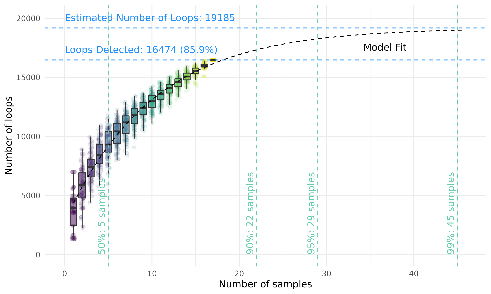
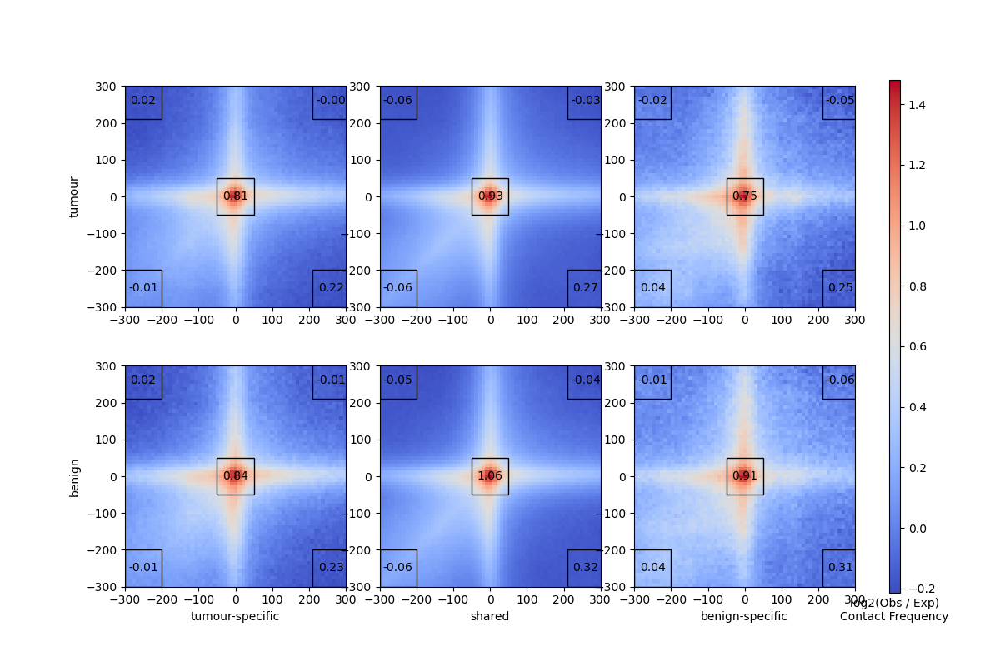

# Summary

In this folder, we consider the loop calls in primary prostate samples, both benign and tumour.

## Data

We use the multi-resolution cooler files from each Hi-C experiment stored in [`../../Data/Processed/2019-06-18_PCa-LowC-sequencing/`](../../Data/Processed/2019-06-18_PCa-LowC-sequencing/).

## Methods

### Identification of significant chromatin interactions

Chromatin interactions were identified in all 17 primary samples with [Mustache](https://doi.org/10.1186/s13059-020-02167-0).
Using the Cooler files from above, Mustache was run on the ICE-normalized 10 kbp contact matrix for each chromosome.
See the `call_loops` rule in [`../../Data/Processed/2019-06-18_PCa-LowC-sequencing/Snakefile`](../../Data/Processed/2019-06-18_PCa-LowC-sequencing/Snakefile) for details.
Interaction calls on each chromosome were merged for each sample to create a single table of interaction calls across the entire genome (`merge_loops` rule in the same `Snakefile`).

To account for variances in detection across samples and to identify similarly called interactions across samples, interaction anchors were aggregated across all samples to form a consensus set (`get-anchors.R`).
Interaction anchors were merged if they overlapped by at least 1 bp.
Interaction anchors for each sample were then mapped to the consensus set of anchors, and these new anchors were used in all subsequent analyses.

### Chromatin interaction saturation analysis

To estimate the detection of all chromatin interactions across all samples, a nonlinear regression on an asymptotic model was performed.
This is similar in method to peak saturation analysis used to assess peaks detected in ChIP-seq experiments from a collection of samples.
Bootstrapping the number of unique interactions detected in a random selection of n samples was calculated for n ranging from 1 to 17.
100 iterations of the bootstrapping process were performed.
An exponential model was fit against the mean number of unique interactions detected in n samples using the `nls` and `SSaymp` functions from the stats R package (v3.6.3).
The model was fit to the following equation:

$$
\mu = \alpha + (R_0 - \alpha) \exp(kn)
$$

| Variable   | Description                                                         |
| ---------- | ------------------------------------------------------------------- |
| $$\mu$$    | mean number of chromatin interactions for a given number of samples |
| $$n$$      | number of samples                                                   |
| $$\alpha$$ | asymptotic limit of the total number of mean detected interactions  |
| $$R_0$$    | response for 0 samples (i.e. $$\mu$$ when $$n = 0$$)                |
| $$k$$      | rate constant                                                       |

The estimated fit was used to predict the number of samples required to reach 50%, 90%, 95%, and 99% saturation of the asymptote.

## Results

### Chromatin interaction calls

We found 68 059 loops across all 17 primary samples, 16 474 unique loops overall.
We detected a median of 4 416 interactions per sample (range 1 292 - 7 040).
This highlights the considerable variability in interaction calls across samples.

To estimate the total number of interactions that could possibly be called with an increased sample size, we performed a saturation analysis.
This resulted in an estimated 20 602 total interactions.

Amongst these detected interactions, we identified known contacts in PCa such as between two distal CREs on chromosome 14 and the FOXA1 promoter, and CREs upstream of MYC on chromosome 8 that are frequently duplicated in metastatic disease.

We also identified two novel interactions in the primary prostate tumours to the FOXA1 promoter missing in PCa cell lines. This suggests that the regulatory plexus of FOXA1 consists of more CREs than previously reported.

### Saturation of chromatin interactions

To identify interactions changes between benign and tumour tissue, we considered interactions that were recurrently called in at least 3 samples, and considered whether they were shared by both tissues or unique to one type.
We found the majority of interactions were shared between the two types, with 533 tumour-specific and 40 benign-specific interactions.

However, upon visual inspection and aggregate peak analysis, these differences appear to be subtle.
Here is the aggregate peak analysis of the so-called benign-specific, tumour-specific, and shared interactions.

There is still an enrichment of contacts in the benign samples in the tumour-specific loops (bottom left), and vice versa (top right).

## Conclusions

If there are changes to chromatin interactions that happen over oncogenesis, they are subtle, both individually, and in aggregate.
The specific interactions ocurring on the same chromosomes are largely consistent across oncogenesis.
