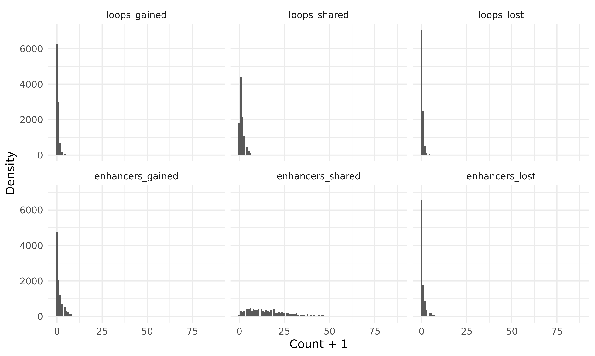

# Summary

This folder is a revamped version of the ideas explored in [`../2020-10-23_t2e-loops/`](../2020-10-23_t2e-loops/).
Here, our goal is to test whether gene expression changes observed in T2E+/- groups can be explained by epigenetic changes in H3K27ac at enhancers and their looping contact with gene promoters.
Our scientific hypothesis is that these changes can be explained as such, but that given the high false negative rate for loop calls, as well as the size of the loops, that we will only be able to provide sufficient evidence for a small number of differentially expressed genes.
The null hypothesis is that there is no relationship between the differential expression of genes and these loops, which we will test.

## Data

We will use a few different datasets:

1. GENCODE gene annotations for promoter regions
2. Catalogue of H3K27ac peaks across the 12 primary tumour samples (the entire list is contained in [`../2020-06-12_sv-disruption-acetylation/Acetylation/T2E/t2e.all.tsv`](../2020-06-12_sv-disruption-acetylation/Acetylation/T2E/t2e.all.tsv))
3. TADs identified in [`../2020-08-29_TADs-downsampled/Aggregated-TADs/separated-TADs/`](../2020-08-29_TADs-downsampled/Aggregated-TADs/separated-TADs/) (window size = 20)
4. Catalogue of loops for all 17 primary samples, as well as the T2E-specific and non-T2E-specific loops identified in [`../2020-10-23_t2e-loops/loops.T2E-specific.tsv`](../2020-10-23_t2e-loops/loops.T2E-specific.tsv) and [`../2020-10-23_t2e-loops/loops.nonT2E-specific.tsv`](../2020-10-23_t2e-loops/loops.nonT2E-specific.tsv), respectively.

## Methods

### GRN construction

We first construct a gene regulatory network (GRN) for each annotated gene.
We do this by identifying the parent TAD for each gene, since regulatory elements are mostly contained within the TAD they inhavit [Symmons _et al_., Genome Research, 2014](https://genome.cshlp.org/content/24/3/390.short).
We then create a graph where the gene promoter and each enhancer within that TAD is a node.
An edge connects two elements that overlap each other's genomic coordinates (such as the peak at a gene's promoter and the promoter region itself) or if there is a loop connecting the two anchors together.

### GRN filtering for T2E-specific epigenetic changes

We will test for an association between differential expression and the presence of differential loops and acetylation changes at loop anchors.
We consider all genes whose GRNs match the following criteria:

1. $\exists \ge 1$ differential loop in the GRN between T2E+ and T2E-
2. The differential loops are all gained or all lost in the T2E+ group
3. $\exists \ge 1$ differential peak in the loop anchors that are all in the same direction as each other, and in the same direction as the differential loop
4. GRN does not have an opposing peak change elsewhere in the GRN

Filters 3 and 4 are to reduce the ambiguous effects of multiple simultaneous epigenetic changes, and to limit the effect of false differential loop classification by prioritizing H3K27ac ChIP-seq data, which has stronger support for it.

The construction of these GRNs can be found in `grn.py`.

### Hypothesis testing

We can look at the effect of each activating epigenetic change by comparing the expression in

1. Genes with a gain of enhancers and no changes to loops in T2E+ to genes with no changes to their GRN
2. Genes with a loss of enhancers and no changes to loops in T2E+ to genes with no changes to their GRN
3. Genes with a gain of loops and no changes to enhancers in T2E+ to genes with no changes to their GRN
4. Genes with a loss of loops and no changes to enhancers in T2E+ to genes with no changes to their GRN

## Results

Starting with the GENCODE v33 annotation, we are able to construct GRNs for 10235 genes.
There is a median of 2 loops (range 1 - 17) and a median of 17 enhancers (range 0 - 98) per gene.

These networks are quite complex, given that many studies focus on only a handful of candidate regulatory elements for a given gene.

18.6% of all genes where a GRN was constructed had differential expression between the T2E+ and T2E- samples (see [`../2020-06-18_sv-disruption-expression/`](../2020-06-18_sv-disruption-expression/) for details).
Given there is a change in gene expression, we found that

* 55.6% of genes had an associated change in loops
* 72.4% of genes had an associated change in enhancer acetylation
* 41.4% of genes had both a loop and enhancer change

We tested whether certain changes to the GRNs were associated with changes to gene expression.

| Alternative hypothesis                                                                                                 | $t$    | $df$ | $p$     | $FDR$   |
| ---------------------------------------------------------------------------------------------------------------------- | ------ | ---- | ------- | ------- |
| Genes with gained enhancers and no loop changes have a greater mean expression than genes with no changes to their GRN | 1.8369 | 1110 | 0.03325 | 0.0665  |
| Genes with lost enhancers and no loop changes have a lesser mean expression than genes with no changes to their GRN    | 1.8369 | 617  | 0.00112 | 0.00447 |
| Genes with gained loops and no enhancer changes have a greater mean expression than genes with no changes to their GRN | 1.8369 | 548  | 0.364   | 0.389   |
| Genes with lost loops and no enhancer changes have a lesser mean expression than genes with no changes to their GRN    | 1.8369 | 398  | 0.389   | 0.389   |

Thus, it appears that enhancer changes in GRNs typically have a stronger effect on mean gene expression changes than loops do.
When loops and enhancers are both gained, the resulting change in gene expression does not appear to be larger than when either loops or enhancers are gained (one-sided t-test, $t = 0.0482$, $df = 687$, $p = 0.481$, $FDR = 0.481$).
However, when loops and enhancers are both lost, the resulting change in gene expression is significantly lower than when either loops are lost or enhancers are lost, alone (one-sided t-test, $t = -2.46$, $df = 162$, $p = 0.00753$, $FDR = 0.0151$).

## Conclusions

Overall, it appears that there may be some small differences in gene expression brought about by changes to the gene regulatory networks.
Most of the cases where there are differences, the ones where only enhancers change fit the canonical model.
This likely stems from some low resolution loop calls, not considering other histone modifications, or poor loop detection in general.
