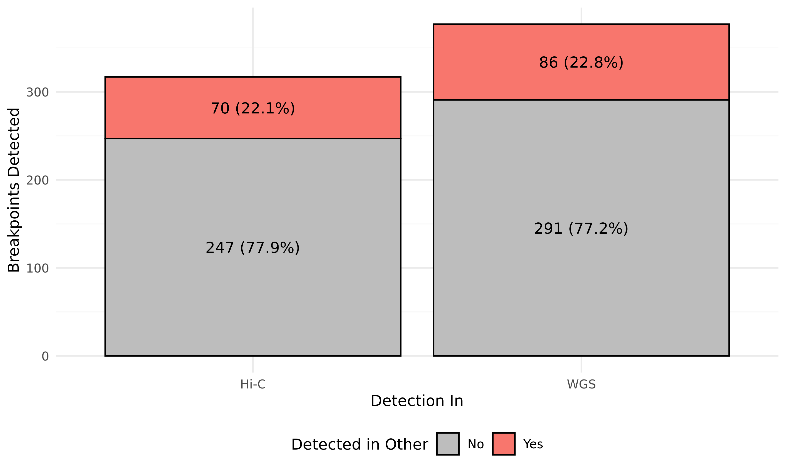
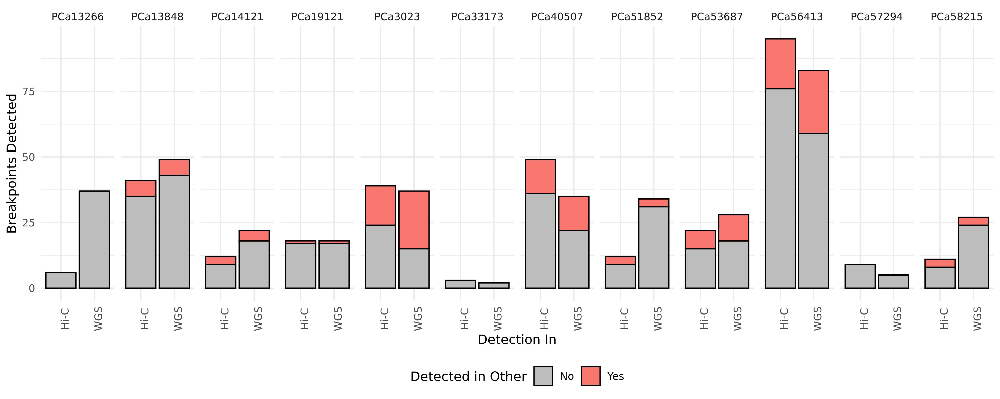

# Summary

This folder contains a comparison of the structural variants identified through whole genome sequencing + Delly and those identified through Hi-C + hic_breakfinder.
This can be run on CodeOcean.

## Results

We mark a breakpoint as mutually called between the two datasets if the WGS breakpoint +/- 50 kbp overlaps with a HiC breakpoint region.
This allows a fuzziness in overlaps due to the granular resolution of the Hi-C calls, but still keeps the overlap below the largest resolution of breakpoint calls.

### Non-1:1 correspondence between breakpoints

We note that this does in theory, however, allow multiple WGS breakpoints to map to the same Hi-C breakpoint, and vice versa.
Multiple WGS breakpoints mapping to the same Hi-C breakpoint is not necessarily a problem, due to their size.
Multiple Hi-C breakpoints, mapping to a single WGS breakpoint, however, is complicated to account for.

There is only 1 such occurrence in our data, on chr11 in `PCa40507`, where the WGS breakpoint is placed in between the 2 Hi-C breakpoints.
The two Hi-C breakpoints are 60 kbp apart and there is a clear separation between the spots in the contact matrices, so it doesn't appear that they should be counted as the same breakpoint, from the Hi-C perspective.
It is unclear how to interpret this particular event, and what it may be in reality, but this 1 event does not change statistics greatly.

### Global comparisons between data types

377 unique breakpoints were identified in the WGS data, and 317 in the Hi-C data.
However, only ~ 20% of breakpoints from either source were similarly identified in the other source.

This observation isn't an effect of individual patients, since the proportion of overlap between the two sources for each patient is small.

This implies that these two methods are largely detecting different events.
