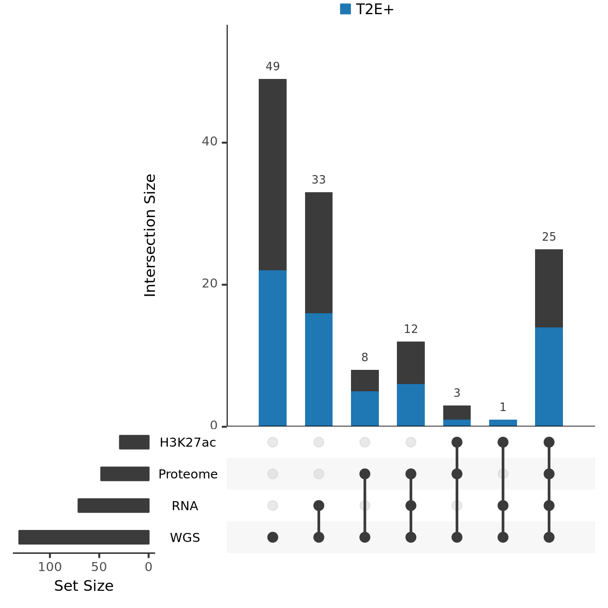

# CPC-GENE sample selection criteria

To make maximal use of the full catalog of data available, we considered which prostate cancer patients had samples assessed by each of the following assays:

* whole genome sequencing
* transcriptome sequencing
* proteomics
* H3K27ac ChIP-seq

The intersection of these datasets resulted in 25 samples that had all 4 assays performed on them and is visualized below.

Previous publications have shown that enhancer promoter loops are difficult to call for samples with fewer than 300M filtered read pairs.
To ensure we would meet this target, and using the observation that approximately 50% of reads are filtered out from most Hi-C data preprocessing pipelines, we aimed for approximately 800M read pairs per sample.
To achieve this resolution, we looked to Illumina's NovaSeq 6000 S4 flowcells, which can sequence 10B read pairs in one run (5B read pairs per flowcell).
This left us with the possibility of sequencing 12.5 samples, which we raised to 13.

To accurately reflect the overall characteristics of prostate cancer, we considered the _TMPRSS2-ERG_ fusion (T2E) that is present in approximately half of all patients, which is highlighted in blue, above.
We selected 7/13 samples to have ERG over-expression, 6 of which are known to have the T2E fusion, and one of which does not.
We selected the remaining 6 samples to be ones that are known to not have ERG over-expression.

This leaves up with the 13 samples in `LowC_samples_Data_Available.`
