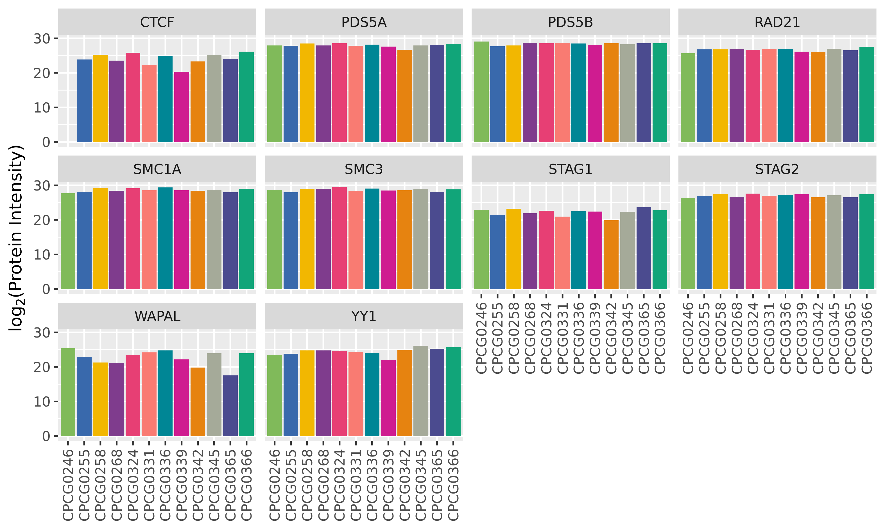

# Summary

This folder contains data showing the protein expression levels of various proteins relating to the cohesin complex, to see if there are patient-specific differences in the formation of this complex.

The following are cohesin complex subunits \Cref{Peter2008}:

* SMC1A
* SMC1B
* SMC3
* RAD21
* REC8
* STAG1
* STAG2
* STAG3
* PDS5A
* PDS5B
* WAPAL
* CDCA5

Additionally, we are aware of the following factors involved in chromatin loop formation:

* ZNF143
* CTCF
* YY1

We look to these to see how prevalent their expression is the set of patient samples.

## Results

The above plot shows protein expression level for each protein of interest.
Proteins mentioned above and not shown here were not measured in the mass spec experiment.
Black line is median expression for that protein, and the grey shaded region is the 95th quantile of absolute median deviation of all proteins across the 13 samples.

All samples lie within this shaded region except for:

* CTCF in CPCG0246 (was `NA` in data)
* CTCF in CPCG0339
* STAG1 in CPCG0346
* WAPAL in CPCG0342 and CPCG0365

We discussed the topic of `NA`s with Dr. Kislinger:

> NA means that no peptides were detected for this protein in a given samples.
> Basically a missing value and a caveat with current proteomics technologies.
> This could mean that indeed that protein is not present or that it was missed by the MS.
> This is more common for lower abundant proteins.
> Basically we still have false negatives.

It is unclear whether CTCF on CPC0246 is absent, or just wasn't detected.
Moreover, it is unclear whether 5 proteins not present in the table (SMC1B, REC8, STAG3, CDC5A, and ZNF143) were absent in all samples or undetected (76 in the original study).

Given that there are not drastic global differences in chromatin organization in any of the samples, we suspect that the `NA` in CPCG0246 is a false negative, and the other factors outside the 95th quantile range, do not appear to have a substantially differential effect.

## Conclusions

Cohesin complex subunits and other chromatin loop associated factors are almost equally expressed in the 13 patients in this study, with minor exceptions.
Given the contact matrices for each patient in other folders, they don't appear to be drastically affected by any differences in protein abundances.

## References

\Cref{Peters2008}: [Peter _et al._, Genes & Dev, 2008](http://genesdev.cshlp.org/content/22/22/3089.full)
