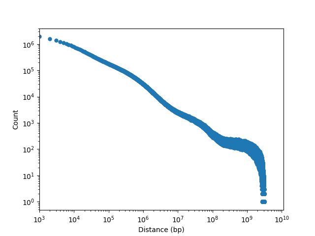

# Summary

This folder contains analysis relating to the degree of contact between gene promoters and enhancers.

## Methods

There are two main methods to address this question.

### Method 1: Read counts from filtered BAMs

### Method 2: Thresholded frequencies from normalized contact matrices

To narrow the bin size to as small as possible while still attempting to keep 1 peak per bin, we use a bin size of 4 kbp.
This is due to the results in `/../2019-05-01_cre-distributions/`.
Each sample has outliers peak sizes above 4 kbp, and non-outliter peak sizes below.
Using this as a threshold size will account for almost all peaks called in each sample.

## Data

We use either the filtered BAM for each sample for Method 1, or the normalzed contact matrix derived from these BAMs for Method 2.

## Results

### Map resolution

Map resolution is defined by the matrix resolution (in bp) such that 80% of bins
have at least 1000 contacts.
See Rao _et al._, Cell, 2014 for this definition.
For each sample we get the following percentage of bins with >= 1000 contacts:

| Sample ID | Percentage at 10 kbp | Percentage at 5 kbp |
| --------- | -------------------- | ------------------- |
| PCa13266  | 87.95                | 65.37               |
| PCa13848  | 79.03                | 27.17               |
| PCa14121  | 86.00                | 60.86               |
| PCa19121  | 83.01                | 44.98               |
| PCa3023   | 82.38                | 39.11               |
| PCa33173  | 89.38                | 64.27               |
| PCa40507  | 79.14                | 37.74               |
| PCa51852  | 87.14                | 65.80               |
| PCa53687  | 80.61                | 38.87               |
| PCa56413  | 85.28                | 45.93               |
| PCa57054  | 89.15                | 68.51               |
| PCa57294  | 86.71                | 59.37               |
| PCa58215  | 83.42                | 47.18               |

Thus, each sample approximately has a map resolution of 10 kbp across all samples.

### Each sample has the same distribution of contacts at a given distance

We consider the number of filtered _cis_ contacts at a given distance to see if there are overall differences in chromatin interconnectedness.
We consider the midpoint of each bin (matrix resolution of 4 kbp) to calculate the distance between contacts.

## Conclusions

This look like a good Hi-C library with a similar distance-decay relationship as is found in other manuscripts.
