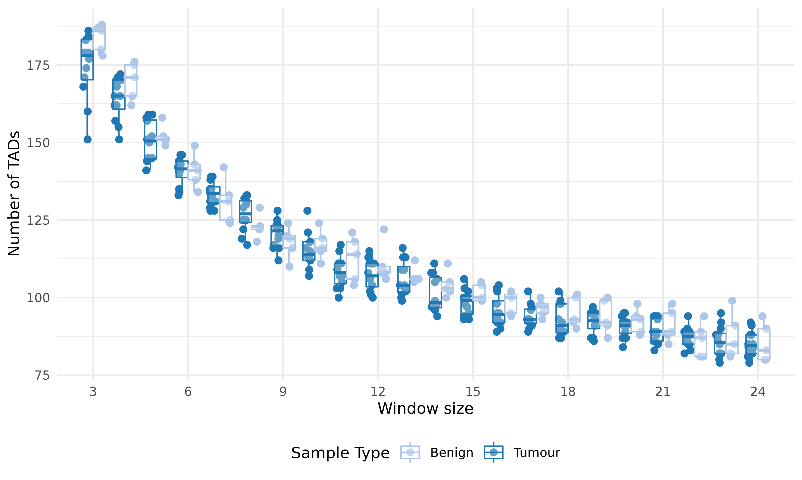
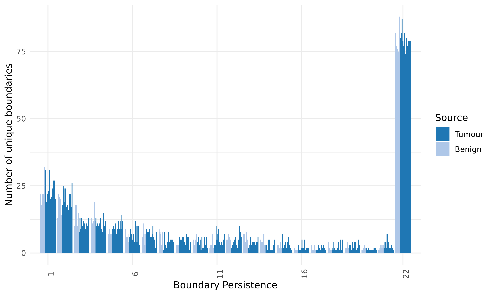
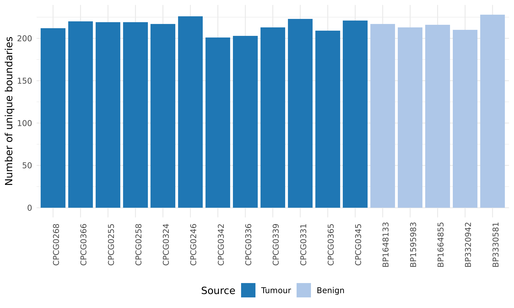

# Summary

The number of TADs identified in primary benign and tumour samples appear to be similar, but marginally different.

Moreover, there is a difference in the number of boundaries called at each window size.

One difference between the tumour and benign samples here is the number of valid, unique read pairs in each sample.
The benign samples contain fewer contacts than all of the tumour samples, and we suspect that the number of TADs, where they're identified, and how they compare to the tumour samples, may stem from this feature.

This folder attempts to check whether this difference is important or not.

## Data & Methods

Using the cooler files for each sample, we will downsample the number of contacts to match the shallowest sample (~ 300 M).
We will then identify TADs as done in [`../2019-07-08_TADs/`](../2019-07-08_TADs/) and [`../2020-01-15_TAD-aggregation/`](../2020-01-15_TAD-aggregation/).
I will also be using the other prostate data where possible.

## Results

After downsampling each cooler file to ~ 300M contacts, I called TADs on chr19.
We find that the number of unique boundaries is comparable between benign and tumour samples.

The same is true for boundaries identified across all window sizes.

Notably, the number of TADs themselves is now roughly equal across all samples and window sizes.

## Conclusions

Calling TADs is a stochastic process that is dependent on the total number of contacts in the matrix.
This is not surprising, but is a factor that needs to be revisited for the first figure of this paper.
This may also factor into how comparisons across cell types are also identified, given that the 4DNucleome samples typically have < 200M contacts in their cooler files.
