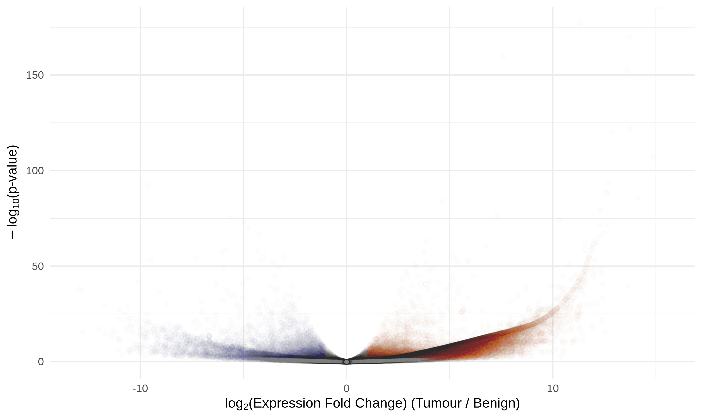

# Differential gene expression analysis

This folder contains differential gene expression analysis between the benign and tumour samples.
This follows the pipeline used elsewhere, with Kallisto + Sleuth.

## Results

There appears to be some major batch effects in the RNA abundances, unless there are typically ~ 15K differentially expressed genes over oncogenesis.

The volcano plot also has a peculiar distribution that I haven't seen before.

## Conclusions

That particular comparison is not central to the manuscript, so I'm going to leave out this data for now.
